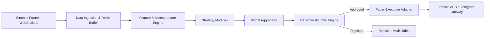

# High-Level Architecture Overview

## 1. System Structure

The AlphaQuant Platform is designed as an asynchronous, event-driven quantitative trading and signal engine for cryptocurrency perpetual futures.

---

## 2. Key Architectural Tenets
1. **Zero Live Risk by Default**: System defaults to `SIGNAL_ONLY` and `PAPER_TRADING`.
2. **Deterministic Risk Controls**: Enforces strict ATR-based stop-loss distances, maximum 1.0% risk per trade, maximum 3 open positions, and automated daily drawdown circuit breakers.
3. **Decoupled Pluggable Strategies**: All strategies implement the standard `IStrategy` interface and generate validated `SignalContract` JSON objects.
4. **Complete Documentation**: For deep implementation specifications, refer to [docs/README.md](file:///c:/cry_agent/v_4_AQ_AI/docs/README.md).
