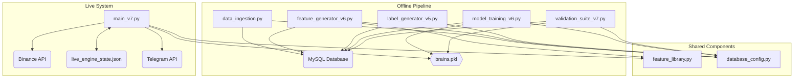

# AlphaQuant System Architecture

This document describes the technical architecture of the AlphaQuant V7 system.

## High-Level Architecture

The system is composed of two distinct but interconnected sub-systems:

1.  **The Offline Pipeline:** A set of Python scripts responsible for data ingestion, feature engineering, model training, and validation. It runs on a schedule (or on-demand) and its final output is a set of serialized AI model files (`.pkl`).
2.  **The Live Engine:** A single, long-running asynchronous application that loads the AI models, connects to the exchange via WebSockets, and performs real-time inference and trade execution.

## System Components

- **Data Store:** A MySQL database that stores all historical market data and engineered features.
- **Feature Library (`feature_library.py`):** A centralized Python module containing all feature calculation logic. This is the single source of truth for feature generation, used by both the offline and live systems.
- **Training Pipeline (`run_full_pipeline_v7.py`):** An orchestrator script that executes the data ingestion, feature generation, labeling, training, and validation stages in sequence.
- **Live Engine (`main_v7.py`):** The core application responsible for 24/7 trading.
- **Auto-Trainer Daemon (`auto_trainer_daemon.py`):** A background service that schedules and runs the Training Pipeline once a week.
- **State Store (`live_engine_state.json`):** A simple JSON file used by the Live Engine to persist its state (open trades, penalty-boxed assets) across restarts.

## Data Flow (Offline Pipeline)

1.  `data_ingestion.py` fetches raw OHLCV data from the Binance API.
2.  Data is stored in the `market_data_1h` table in MySQL.
3.  `feature_generator_v6.py` reads from `market_data_1h`, uses `feature_library.py` to compute features, and saves them to the `feature_store` table.
4.  `label_generator_v5.py` reads from `market_data_1h`, computes Triple Barrier labels, and updates the `feature_store` table.
5.  `model_training_v6.py` reads the complete dataset from `feature_store`, trains the ensemble models, and saves them as `.pkl` files.
6.  `validation_suite_v7.py` reads from `feature_store` and loads the `.pkl` files to generate a performance report.

## Event Flow (Live Engine)

1.  On startup, `main_v7.py` loads all `.pkl` models and the `live_engine_state.json` file into memory.
2.  It establishes a persistent WebSocket connection to Binance using `ccxt.pro` to receive real-time ticker data for all target assets.
3.  Every 3 minutes, the `ml_inference_loop` triggers.
4.  For each asset, it fetches the latest 250 candles via a REST API call.
5.  It uses `feature_library.py` to generate features for the new data.
6.  It identifies if a primary signal (Trend, Breakout, Reversion) has occurred on the last closed candle.
7.  If a signal exists, it loads the corresponding specialized model and generates a prediction.
8.  If the prediction's confidence exceeds the required threshold, a trade is executed.
9.  The open trade is added to the `active_trades` list and the state is saved to `live_engine_state.json`.
10. The `manage_active_trades` function continuously checks the live ticker price against the open trade's SL/TP levels.

## Deployment Architecture

- **Server:** Ubuntu Linux
- **Process Management:** The Live Engine and Auto-Trainer Daemon run as two separate, persistent background services managed by `screen`.
- **Database:** A local MySQL server instance.
- **Code Deployment:** Code is pushed to a private GitHub repository and deployed to the server via `git pull`.

## Module Dependency Diagram

