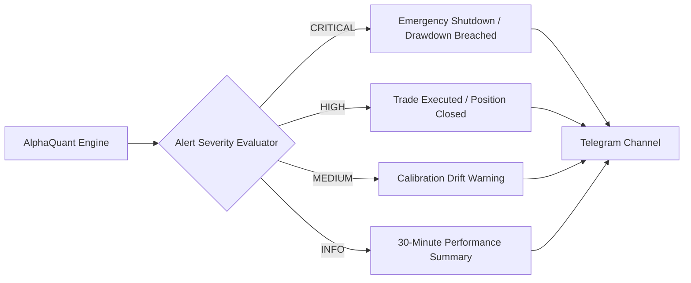

# Alerting Policy & Telegram Gateway

## 1. Telegram Alerting Policy & Severity Levels

The platform routes all high-priority alerts, trade execution notices, and system health status cards to a dedicated private Telegram channel:



---

## 2. Notification Templates

### A. Trade Execution Alert (Paper Trading)
```
⚡ [ALPHAQUANT AI] TRADE EXECUTED (PAPER)

• Asset: SOL/USDT
• Direction: LONG
• AI Win Probability: 71.67%
• Entry Target: $96.3500
• Take Profit: $98.5500
• Stop Loss: $94.8500
• Market Regime: TREND
• Quantity: 0.4500 ($43.35 Notional)

Status: Executing automatically (Paper Mode)
```

### B. Trade Closed / PnL Resolution Alert
```
🟢 🔔 [PAPER BOT] TRADE CLOSED — PROFIT

• Asset: `SOL/USDT` | Direction: `LONG`
• Net PnL: `+$1.55 USD`
• Entry: `$96.3500` → Exit: `$98.5500`
• TP Target: `$98.5500` | SL Level: `$94.8500`

📊 Running Paper Win Rate: 71.11% (32W / 13L) | Total P&L: +$73.21 USD
```

### C. Emergency Circuit Breaker Alert
```
🚨 🔴 [CRITICAL CIRCUIT BREAKER TRIPPED]

• Account Drawdown: 2.75% (Threshold: 2.50%)
• Current Equity: $972.50 USD (Peak: $1,000.00 USD)
• Action: All new entries LOCKED for 24 hours.
• Manual intervention required to clear status.
```
