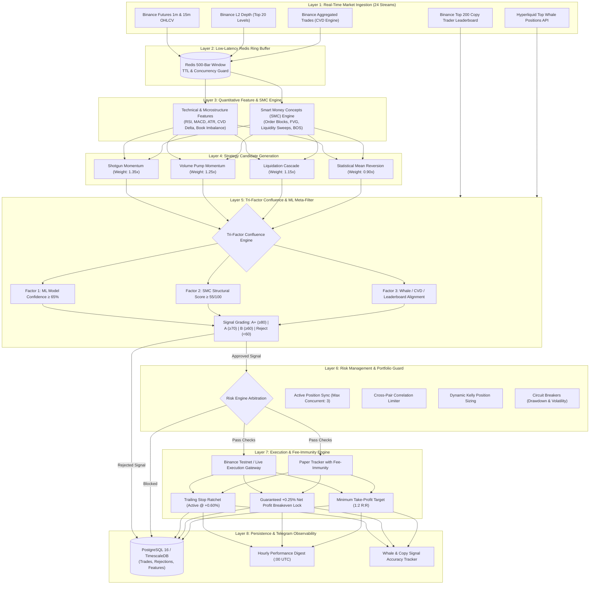

# 🏛️ AlphaQuant Institutional Platform: End-to-End Process Flow & Architecture

> **Document Version**: 4.2.0 (Post-Audit Production Grade)  
> **Last Updated**: September 2026  
> **Status**: ✅ Production Active on Azure Cluster (`172.160.241.212`)  
> **Target Subdomain**: `https://bot.ceylonriviera.com`

---

## 📌 1. High-Level System Architecture Diagram

The AlphaQuant platform is an institutional-grade quantitative trading system combining **Smart Money Concepts (SMC)**, **Supervised Machine Learning (XGBoost Meta-Labeling)**, **Microstructure Order Flow (CVD & L2 Depth)**, and **On-Chain Whale & Copy Leaderboard Intelligence**.



---

## ⚙️ 2. Detailed Step-by-Step Process Flow

```
+-----------------------------------------------------------------------------------------------+
|                                    ALPHAQUANT PIPELINE FLOW                                   |
+-----------------------------------------------------------------------------------------------+
  [Step 1] Ingestion       ==> 24 async WebSockets stream 1m/15m OHLCV, CVD ticks & L2 depth.
  [Step 2] Caching         ==> Push directly to Redis ring buffers (500 bars per stream).
  [Step 3] Features & SMC  ==> Extract 12 technical/orderbook indicators + 5 SMC factors.
  [Step 4] Strategies      ==> Generate candidate trade proposals with dynamic strategy weights.
  [Step 5] Tri-Factor      ==> Confluence: ML Prob >= 65% + SMC >= 55 + Whale/CVD Confirmation.
  [Step 6] Risk Guard      ==> Enforce Max Positions (3), Correlation check & Kelly capital limits.
  [Step 7] Execution       ==> Route order to Binance Futures Execution / Paper Tracker.
  [Step 8] Fee-Immunity    ==> Trailing Stop activates @ +0.60%; Breakeven locks @ >= +0.25% Net.
  [Step 9] Observability   ==> Store in PostgreSQL 16 & dispatch Hourly Summary to Telegram.
+-----------------------------------------------------------------------------------------------+
```

---

### Step 1: Ingestion & Live Market Streaming
* **24 Concurrent WebSocket Streams**: Ingests Binance Futures data across 6 primary pairs: `BTC/USDT`, `ETH/USDT`, `SOL/USDT`, `LINK/USDT`, `SUI/USDT`, `AVAX/USDT`.
* **Multi-Timeframe OHLCV**: 1-minute (execution timing) and 15-minute (trend/SMC structure) candles.
* **Cumulative Volume Delta (CVD)**: Real-time calculation of aggressive buyer volume minus aggressive seller volume (`taker_buy_base_asset_volume`).
* **L2 Order Book Depth**: Snapshot of the top 20 bid/ask levels every 100ms to detect bid/ask walls and liquidity imbalances.
* **External Intelligence Feeds**:
  - **Binance Copy Trader Leaderboard**: Scrapes top 200+ verified profitable traders' consensus.
  - **Hyperliquid On-Chain Whales**: Monitors high-net-worth wallet position shifts.

---

### Step 2: In-Memory Ring Buffering (Redis)
* Low-latency Redis in-memory storage holding a rolling window of **500 bars** per pair/timeframe.
* Automatic TTL cleanup ensuring zero memory leaks and sub-millisecond retrieval speeds for feature computation.

---

### Step 3: Feature Engineering & Smart Money Concepts (SMC) Engine
Every closed candle triggers a parallel feature extraction pipeline:
1. **Technical Indicators**: RSI (14), MACD (12, 26, 9), ATR (14), Bollinger Bands, EMA fast/slow cross.
2. **Microstructure Indicators**: CVD Trend Slope, Depth Imbalance Ratio, Volume Surges.
3. **Smart Money Concepts (SMC) Scoring (0 - 100)**:
   - **Order Blocks (25%)**: Institutional buying/selling zones before aggressive displacement.
   - **Fair Value Gaps (FVG) (20%)**: 3-candle price imbalances ripe for liquidity fills.
   - **Liquidity Sweeps (20%)**: Rejection wicks piercing previous swing highs/lows.
   - **Break of Structure (BOS) (20%)**: Structural market break confirming continuation.
   - **Multi-Timeframe Trend Alignment (15%)**: 15m vs 1h/4h macro bias alignment.

---

### Step 4: Strategy Signal Generation & Weighting
Four independent strategies evaluate the enriched candle data:
| Strategy Name | Weight | Primary Role | Trigger Condition |
| :--- | :---: | :--- | :--- |
| **Shotgun Momentum** | **1.35x** | Core Trend Follower | Strong CVD expansion + 15m Trend + Low Rejection |
| **Volume Pump Momentum** | **1.25x** | Volume Breakout Scanner | Multi-bar volume spike (>2.5x ATR volume) with breakout |
| **Liquidation Cascade** | **1.15x** | Squeeze Opportunist | Heavy open interest drop + sudden price deviation |
| **Statistical Mean Reversion** | **0.90x** | Extreme Range Fades | Price touches 2.5x Bollinger band + Depth Wall Absorption |

---

### Step 5: Tri-Factor Institutional Confluence Engine
A trade proposal is only minted if it achieves confluence across 3 independent factors:

```
                  ┌────────────────────────────────────────────────────────┐
                  │          TRI-FACTOR CONFLUENCE ARBITRATION             │
                  └──────────────────────────┬─────────────────────────────┘
                                             │
             ┌───────────────────────────────┼───────────────────────────────┐
             ▼                               ▼                               ▼
    [Factor 1: ML Brain]            [Factor 2: SMC Score]        [Factor 3: External Intel]
   XGBoost Meta-Probability         Order Blocks + FVG + BOS      Hyperliquid Whales + CVD +
          (≥ 65.0%)                       (≥ 55 / 100)               Copy Trader Consensus
             │                               │                               │
             └───────────────────────────────┼───────────────────────────────┘
                                             ▼
                               ┌───────────────────────────┐
                               │     CONFLUENCE GRADE      │
                               │  A+ (≥80) | A (≥70) | B   │
                               └───────────────────────────┘
```

* **Factor 1 (Supervised ML)**: Pre-trained XGBoost classifiers evaluate market state against historical win probability. Must meet or exceed $65.0\%$ threshold.
* **Factor 2 (SMC Structural Grade)**: The SMC Engine verifies institutional footprint. Must score $\ge 55/100$.
* **Factor 3 (External Validation)**: Confirms that CVD delta, order book walls, or whale sentiment agree with the direction.
* **Confluence Grading**:
  - **Grade A+ ($\ge 80$)**: 1.0x Full Risk Allocation.
  - **Grade A ($\ge 70$)**: 0.75x Standard Risk Allocation.
  - **Grade B ($\ge 60$)**: 0.50x Reduced Risk Allocation.
  - **Grade C / Reject ($< 60$)**: Dropped immediately with rejection reason logged to database.

---

### Step 6: Institutional Risk Guard & Arbitration
Before execution, the candidate passes through the deterministic **Risk Engine**:
* **Active Position Synchronizer**: Invariant check enforcing maximum of 3 concurrent positions across the entire portfolio.
* **Cross-Pair Correlation Filter**: Prevents taking 3 identical LONG positions on highly correlated assets (e.g., BTC, ETH, SOL simultaneously).
* **Fractional Kelly Sizing**: Sizes position capital according to win probability and estimated volatility.
* **Circuit Breakers**: Halts trading if daily drawdown exceeds $2.0\%$ or hourly volatility spikes beyond safety thresholds.

---

### Step 7 & 8: Execution & Fee-Immunity Engine
To completely eliminate taker fee friction (0.10% roundtrip taker drag), orders execute under strict mathematical profit boundaries:
* **Minimum Take Profit Target**: All trades enforce an initial target of at least **+1.60%** with a **1:2.0 Risk-to-Reward Ratio**.
* **Dynamic Trailing Stop Ratchet**:
  - **Activation Threshold**: Requires a minimum gross gain of **$+0.60\%$** (or $1.0\times$ ATR) before trailing is activated.
  - **Guaranteed Breakeven Lock**: Once active, the stop-loss is immediately ratcheted to **$+0.25\%$ Net Profit** above entry price. This guarantees that any trailing exit yields positive profit after 0.10% exchange fees.
  - **Peak Following**: Trailing stop follows peak price at a distance of $1.2\times$ ATR.

---

### Step 9: Observability, Persistence & Telegram Gateway
* **Database Telemetry**: PostgreSQL 16 / TimescaleDB records:
  - Every candle bar and feature snapshot (`ohlcv_bars`).
  - Every rejected trade proposal with exact rejection reason (`signal_rejections`).
  - Macro sentiment metrics and drift outcomes (`macro_sentiment_metrics`).
* **Hourly Telegram Executive Performance Digest**:
  - Automatically dispatched every hour at `:00 UTC`.
  - Displays: Hourly Win Rate, Settled Trades, Net Realized P&L, Cumulative All-Time Stats, Active Positions, and Risk Guard Status.
* **Whale & Copy Signal Tracker**: Silently tracks on-chain whale calls and updates TP1 (+1.2%), TP (+3.0%), and BE locks (+1.0% MFE).

---

## 📊 3. Summary of System Safety Invariants

| Invariant / Rule | Setting / Value | Purpose |
| :--- | :---: | :--- |
| **Max Concurrent Positions** | 3 Positions | Prevents over-leveraging and liquidation risk |
| **ML Confidence Floor** | $\ge 65.0\%$ | Eliminates low-edge coin-flip trades |
| **SMC Structural Minimum** | $\ge 55 / 100$ | Ensures alignment with smart money order flow |
| **Fee-Immunity Lock** | $+0.25\%$ Net Buffer | Neutralizes 0.10% Binance taker fee drag |
| **Trailing Stop Activation** | $+0.60\%$ Gross MFE | Prevents early shakeouts on market noise |
| **Max Daily Portfolio Risk** | $2.0\%$ Drawdown | Automatic safety kill switch |
| **Telegram Summary Cadence** | Every 60 Minutes (`:00 UTC`) | High-clarity executive reporting without spam |
