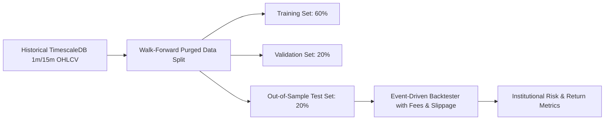

# Quantitative Backtesting & Evaluation Framework

## 1. Bias-Free Backtesting Architecture

To prevent historical curve-fitting and inflated performance, the backtesting engine (`vectorized_backtester.py`) operates under strict institutional standards:

---

## 2. Mandatory Evaluation Metrics

A strategy is never evaluated solely on total return. The evaluation suite requires:
* **Profit Factor**: $\ge 1.75$ on Out-of-Sample data.
* **Sharpe Ratio (Annualized)**: $\ge 1.50$.
* **Sortino Ratio (Downside Risk)**: $\ge 2.00$.
* **Maximum Peak-to-Trough Drawdown**: $\le 10.0\%$.
* **Win Rate**: $\ge 55.0\%$ with positive Expectancy.
* **Fee-Adjusted Expectancy**: Must remain positive after deducting $0.10\%$ roundtrip fees per trade.

---

## 3. Anti-Bias Measures

1. **Lookahead Bias Prevention**: Features calculated at bar $t$ strictly use data from $[0, t-1]$.
2. **Purged K-Fold Cross-Validation**: Implements combinatorial purged cross-validation to remove serial correlation leakage between consecutive overlapping trade bars.
3. **Realistic Execution Fills**: Orders are only filled on subsequent bar prices ($t+1$), never on the signal generation bar.
