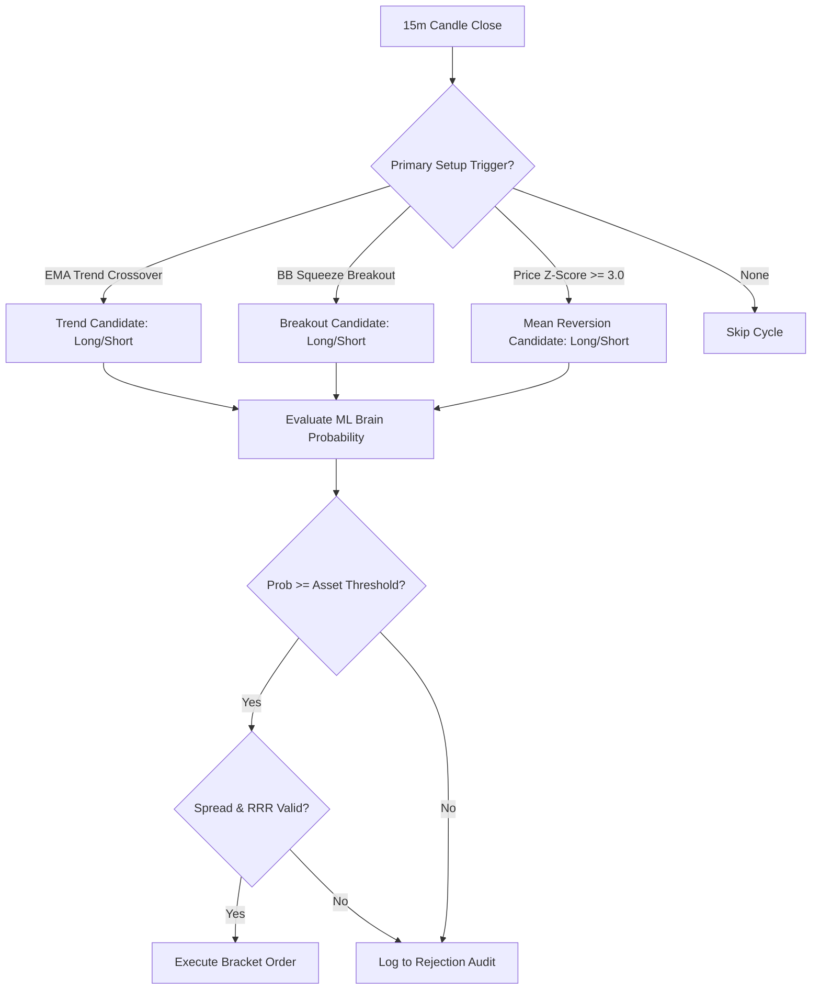

# Bot 1: AlphaQuant V8.2 (Live Main Engine)

## 1. Purpose & Objectives
**AlphaQuant V8.2** is a multi-asset quantitative trading bot operating primarily on a **15-minute timeframe**. Its technical objective is to detect sustained momentum expansions, trend breakouts, and extreme statistical price overextensions across Binance USDⓈ-M Futures, validating them using pre-trained machine learning classifiers.

---

## 2. Directory Structure & Key Files
```
c:\cry_agent\v_4_AQ_AI\
├── main_v7.py                  # Primary monolithic execution script (1,450 lines)
├── feature_library.py          # Quantitative indicator calculation module
├── model_training_v7.py        # Offline XGBoost model training script
├── feature_generator_v7.py     # Batch feature pipeline for database storage
├── live_engine_state.json      # In-memory runtime state snapshot
├── trading_log_v8.csv          # Trade execution log
└── *_brain.pkl                 # Serialized XGBoost ML models per asset
```

---

## 3. Entry Points & Runtime Lifecycle
* **Entry Command**: `python main_v7.py`
* **Systemd Service**: `aq-live-main.service`
* **Lifecycle**:
  1. Bootstraps environment variables (`TELEGRAM_TOKEN`, `TELEGRAM_CHAT_ID`, `DB_PASS`, `USE_TESTNET`).
  2. Loads 9 pre-trained ML brain `.pkl` files into in-memory dictionary `loaded_brains`.
  3. Establishes CCXT Pro WebSocket streams for target asset ticker/candle feeds.
  4. Launches periodic inference loop (`INFERENCE_INTERVAL_SECONDS = 900` / 15 minutes).
  5. Executes signal candidate identification $\rightarrow$ ML scoring $\rightarrow$ Risk/Spread check $\rightarrow$ Order execution $\rightarrow$ Position monitoring loop.

---

## 4. Supported Markets & Timeframes
* **Markets**: Binance Futures USDT perpetuals (`BTC/USDT`, `ETH/USDT`, `SOL/USDT`, `NEAR/USDT`, `SUI/USDT`, `HBAR/USDT`, `XRP/USDT`, `LINK/USDT`, `AVAX/USDT`, `DOGE/USDT`, `DOT/USDT`).
* **Timeframe**: 15m (`TIMEFRAME = "15m"`).

---

## 5. Technical Indicators & Feature Vector
Calculates 12 quantitative features normalized for ML model inference:
1. `dist_ema_50`: Percentage distance of close price from 50-period EMA: `(close - ema_50) / ema_50`.
2. `dist_ema_200`: Percentage distance of close price from 200-period EMA: `(close - ema_200) / ema_200`.
3. `atr_pct`: 14-period Average True Range normalized by close price: `atr / close`.
4. `volume_zscore`: Rolling 120-period $Z$-score of bar volume.
5. `adx_14`: 14-period Average Directional Index measuring trend strength.
6. `bb_width`: Bollinger Band width relative to 20-period SMA: `(Upper - Lower) / SMA_20`.
7. `funding_rate_zscore`: 30-period rolling $Z$-score of 8-hour funding rates.
8. `oi_zscore`: 30-period rolling $Z$-score of Open Interest.
9. `rsi_14`: Wilder's 14-period Relative Strength Index.
10. `macd_hist`: 12/26/9 MACD histogram spread.
11. `supertrend_direction`: ATR-based Supertrend direction ($+1$ for Bullish, $-1$ for Bearish).
12. `chop_index`: 14-period Choppiness Index ($0 - 100$).

---

## 6. Strategy Logic & Signal Generation Rules
Bot 1 operates a **Three-Pillar Shotgun Setup Trigger**:



1. **Trend Following**: Fast EMA (9) / Slow EMA (21) crossover aligned with 200 EMA baseline.
2. **Volatility Breakout**: 100-period 10th-percentile Bollinger Band squeeze followed by band expansion breach.
3. **Statistical Mean Reversion**: 200-period price $Z$-score exceeding $\pm 3.0$ standard deviations.

---

## 7. Risk Controls & Position Sizing
* **Risk per Trade**: 1.0% of margin balance.
* **Stop-Loss Calculation**: Set dynamically using $1.5 \times \text{ATR}_{14}$ from entry.
* **Take-Profit Calculation**: Set dynamically using $1.5 \times \text{SL distance}$ (enforcing minimum 1:1.5 RRR).
* **Position Sizing Formula**:
  $$\text{Quantity} = \frac{\text{Balance} \times \text{Risk Factor} \times 0.01}{|\text{Entry} - \text{Stop Loss}|}$$
* **Maximum Concurrent Positions**: Hard limit of 3 open positions.
* **Spread Circuit Breaker**: Rejects trades if bid-ask spread exceeds 0.15%.

---

## 8. Historical Performance Record (Aug 08 – Aug 25, 2026)
* **Total Completed Trades**: 45
* **Wins**: 32 (71.11%)
* **Losses**: 13 (28.89%)
* **Net P&L**: **+$73.21 USD**
* **Profit Factor**: **3.42**
* **Average Win / Average Loss**: +$3.23 / -$2.33
* **Directional Asymmetry**: LONG trades achieved an **81.2% Win Rate** (16 trades, +$38.59 PnL); SHORT trades achieved **65.5% Win Rate** (29 trades, +$34.62 PnL).
* **Top Assets**: `NEAR/USDT` (90.0% Win Rate, +$37.66 PnL), `AVAX/USDT` (75.0% Win Rate, +$9.58 PnL), `XRP/USDT` (75.0% Win Rate, +$1.69 PnL).

---

## 9. Strengths, Weaknesses, & Tech Debt
* **Strengths**: Statistically proven edge on 15m timeframe, high Profit Factor (3.42), robust trade logging.
* **Weaknesses**: Monolithic script structure, synchronous REST calls inside async loop, tight coupling between data and execution.
* **Technical Debt**: Hardcoded Telegram credentials in configuration fallback, in-memory state tracking without atomic database transactions.
