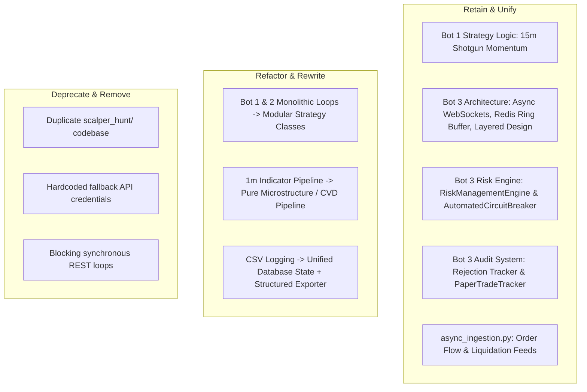

# Comparative Systems Analysis: Bot 1 vs Bot 2 vs Bot 3

## 1. Architectural & Functional Comparison Matrix

| Evaluation Dimension | Bot 1: AlphaQuant V8.2 | Bot 2: SCALPER_HUNT | Bot 3: AlphaQuant Paper Quant |
| :--- | :--- | :--- | :--- |
| **Code Structure** | Monolithic (`main_v7.py`) | Monolithic Fork (`scalper_hunt/main_v7.py`) | Layered Modular (`ai_quant_bot/`) |
| **Timeframe Architecture** | 15-Minute Polling Loop | 15-Minute Fast Polling | 1-Minute Real-Time WebSockets |
| **Concurrency Model** | Hybrid `asyncio` / Blocking REST | Hybrid `asyncio` / Blocking REST | Pure Async Event Loop (`ccxt.pro`) |
| **Memory Buffer Management** | Unbounded in-memory Python lists | Unbounded in-memory Python lists | Redis Ring Buffer (Capped at 500 bars) |
| **Persistence Layer** | Flat CSV + Raw SQLite/Postgres | Flat CSV + Raw SQLite/Postgres | SQLAlchemy ORM + TimescaleDB + CSV |
| **Pre-Flight Validation** | Basic API sanity check | Basic API sanity check | 5-Point Production Sanity Suite |
| **Risk Management** | Dynamic ATR Sizing | Dynamic ATR Sizing (Tighter) | Modular `RiskManagementEngine` Class |
| **Circuit Breakers** | Daily Drawdown Flag | Daily Drawdown Flag | Automated `AutomatedCircuitBreaker` Class |
| **Stale Feed Watchdog** | Basic Heartbeat Ping | Basic Heartbeat Ping | Sub-second `WebSocketWatchdog` (120s) |
| **Missed Opportunity Audit** | Not Implemented | Not Implemented | Database-Backed Rejection Outcome Tracker |
| **Historical Win Rate** | **71.11%** (45 trades) | **47.17%** (53 trades) | **41.48%** (135 trades) |
| **Historical Net P&L** | **+$73.21 USD** | **-$2.11 USD** | **+$0.11 USD** |
| **Profit Factor** | **3.42** (High Quality) | **0.62** (Unfavorable) | **1.03** (Breakeven) |
| **Operating Posture** | Demo / Testnet Mode | Demo / Testnet Mode | Automated Paper Simulation |

---

## 2. Granular Dimension Evaluations

### A. Data Ingestion & Quality
* **Winner**: **Bot 3 (`ai_quant_bot`)**
* **Rationale**: Bot 3 uses `ccxt.pro` async WebSockets with an in-memory Redis ring buffer, pre-warming on boot, and automated stale-data watchdog monitoring. Bots 1 and 2 rely on blocking REST calls inside their inference loops which can introduce latency jitter.

### B. Strategy & Signal Quality
* **Winner**: **Bot 1 (`AlphaQuant V8.2`)**
* **Rationale**: Bot 1's 15-minute timeframe filters out sub-minute noise and achieves a proven **71.11% win rate** with a **3.42 profit factor**. Bot 2 suffers from fee drag on micro-scalps (47.17% WR), while Bot 3 suffers from 1-minute indicator noise (41.48% WR).

### C. Risk Management & Portfolio Controls
* **Winner**: **Bot 3 (`ai_quant_bot`)**
* **Rationale**: Bot 3 encapsulates risk controls in a dedicated, testable `RiskManagementEngine` class with strict fail-closed validation, ATR-based dynamic stop distances, margin ceilings, and an automated circuit breaker.

### D. Observability & Telemetry
* **Winner**: **Bot 3 (`ai_quant_bot`)**
* **Rationale**: Bot 3 implements a formal rejection tracking engine that continuously calculates the theoretical Expected Value (EV) of filtered trades, combined with structured logging, clean Telegram alert cards, and automated win rate tracking.

### E. Maintainability & Technical Debt
* **Winner**: **Bot 3 (`ai_quant_bot`)**
* **Rationale**: Bots 1 and 2 are 1,450-line monolithic scripts where UI alerting, data fetching, feature engineering, and order routing are tightly coupled. Bot 3 adheres to clean separation of concerns across `config`, `data`, `features`, `execution`, `models`, and `monitoring`.

---

## 3. Unification Recommendations

### Components to Retain:
1. **Bot 1's 15m Strategy Math**: Proven statistical edge (71.11% WR, 3.42 PF).
2. **Bot 3's Layered Package Structure**: Clean directory layout, async collectors, Redis buffers, and PostgreSQL schemas.
3. **Bot 3's Rejection Audit Engine**: Real-time counterfactual analysis of rejected signals.
4. **`async_ingestion.py` Daemon**: Continuous collection of tick trades, funding rates, and liquidation events.

### Components to Rewrite / Refactor:
1. **Strategy Layer**: Convert Bot 1's procedural signal rules into an isolated `ShotgunMomentumStrategy` class implementing a unified `Strategy` interface.
2. **1-Minute Quantitative Features**: Replace lagging indicators (RSI, MACD) on the 1-minute engine with pure microstructure features (CVD, order book depth, liquidation volume).
3. **Configuration Subsystem**: Unify all settings into a single environment-driven `.env` and `config.yaml` hierarchy.

### Components to Deprecate / Remove:
1. **`scalper_hunt/` Directory**: Forked duplicate code with negative expectancy.
2. **Hardcoded Fallback Secrets**: Remove all embedded tokens and API keys across all repository files.
3. **Blocking Synchronous Loops**: Eliminate legacy threads making unthrottled REST requests.
