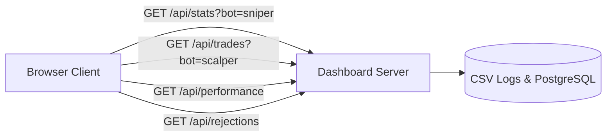

# Current API Documentation

## 1. Overview
The AlphaQuant platform interfaces with external exchange APIs (Binance USDⓈ-M Futures), messaging gateways (Telegram Bot API), and exposes an internal HTTP REST API for the Web Dashboard.

---

## 2. External Exchange API (Binance USDⓈ-M Futures)

Integrated via CCXT / CCXT Pro Python library with unified methods:

| Method / Endpoint | Protocol | Purpose | Authentication | Rate Limit Weight |
| :--- | :--- | :--- | :--- | :--- |
| `wss://fstream.binance.com/ws/{symbol}@kline_1m` | WebSocket | Real-time 1m OHLCV candle streams | Public | Zero Weight |
| `fetch_ohlcv(symbol, timeframe, since, limit)` | REST (`GET /fapi/v1/klines`) | Buffer pre-warming on boot | Public | Weight: 5 |
| `fetch_balance()` | REST (`GET /fapi/v2/balance`) | Margin equity queries | HMAC-SHA256 Signed | Weight: 5 |
| `fetch_positions()` | REST (`GET /fapi/v2/positionRisk`) | Position reconciliation | HMAC-SHA256 Signed | Weight: 5 |
| `create_order(symbol, type, side, amount, price, params)` | REST (`POST /fapi/v1/order`) | Bracket order entry / TP / SL | HMAC-SHA256 Signed | Weight: 1 |
| `fetch_ticker(symbol)` | REST (`GET /fapi/v1/ticker/bookTicker`) | Real-time bid/ask spread audit | Public | Weight: 2 |

---

## 3. Telemetry Gateway API (Telegram Bot)

Communicates via Telegram Bot API (`https://api.telegram.org/bot<TOKEN>/`):

| Endpoint | Method | Payload Parameters | Purpose |
| :--- | :--- | :--- | :--- |
| `/sendMessage` | `POST` | `chat_id`, `text`, `parse_mode="Markdown"`, `reply_markup` | Trade proposals, execution alerts, PnL summaries, health alerts |
| `/getUpdates` | `POST` | `offset`, `timeout=10`, `allowed_updates=["callback_query"]` | Long-polling confirmation gates for manual entry approvals |
| `/answerCallbackQuery` | `POST` | `callback_query_id`, `text` | Acknowledging button clicks |

---

## 4. Internal Dashboard REST API (`dashboard_app.py`)

Hosted on `http://<SERVER_IP>:8080/`:

### Endpoints:
* `GET /`: Serves the primary single-page HTML5/CanvasJS dashboard (`templates/index.html`).
* `GET /api/stats?bot={sniper|scalper}`:
  * Returns JSON payload containing: Total Trades, Win Rate, Total PnL, Profit Factor, Average Win, Average Loss, Max Drawdown, and current wallet balance.
* `GET /api/trades?bot={sniper|scalper}`:
  * Returns array of the latest 250 executed trades with columns: `timestamp`, `asset`, `direction`, `entry`, `sl`, `tp`, `status`, `win_prob`, `pnl`, `exit_price`.
* `GET /api/rejections`:
  * Returns array of the last 100 rejected trade candidates from the `signal_rejections` PostgreSQL table.
* `GET /api/performance`:
  * Returns cumulative PnL equity curve time-series data for charting.
