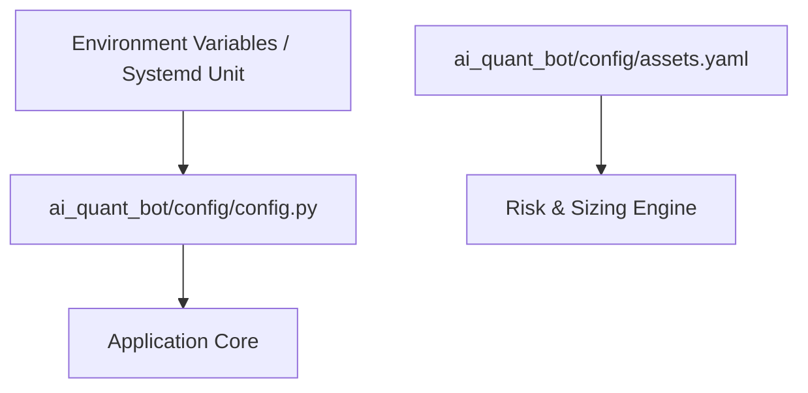

# Current Configuration & Threshold Matrix

## 1. Configuration Hierarchy

The system configuration is spread across environment variables, Python configuration modules, and YAML parameter files:



---

## 2. Environment Variables Matrix

| Variable Name | Required | Default Value | Purpose | Sensitive |
| :--- | :--- | :--- | :--- | :--- |
| `USE_TESTNET` | Yes | `True` | Flags demo/testnet vs live order routing | No |
| `SIMULATION_MODE` | No | `True` | Forces in-memory virtual paper execution | No |
| `BINANCE_API_KEY` | Conditional | `""` | Binance Futures API Key | **Yes (Secret)** |
| `BINANCE_API_SECRET` | Conditional | `""` | Binance Futures API Secret | **Yes (Secret)** |
| `TELEGRAM_TOKEN` | Yes | `""` | Telegram Bot API Token | **Yes (Secret)** |
| `TELEGRAM_CHAT_ID` | Yes | `""` | Telegram Recipient Channel ID | No |
| `DB_NAME` | No | `ai_quant_db` | PostgreSQL database name | No |
| `DB_USER` | No | `postgres` | PostgreSQL username | No |
| `DB_PASS` | Yes | `""` | PostgreSQL password | **Yes (Secret)** |
| `DB_HOST` | No | `localhost` | PostgreSQL hostname | No |
| `DB_PORT` | No | `5432` | PostgreSQL port | No |
| `REDIS_HOST` | No | `localhost` | Redis server hostname | No |
| `REDIS_PORT` | No | `6379` | Redis server port | No |

---

## 3. Asset-Specific Threshold & Sizing Matrix (`assets.yaml`)

Based on mathematically optimal calibration thresholds generated from out-of-sample cross-validation:

```yaml
assets:
  SOL/USDT:
    confidence_threshold_long: 65.0
    confidence_threshold_short: 60.0
    risk_factor: 1.0
    sl_atr_multiplier: 1.5
    tp_atr_multiplier: 2.25

  NEAR/USDT:
    confidence_threshold_long: 65.0
    confidence_threshold_short: 60.0
    risk_factor: 0.75
    sl_atr_multiplier: 1.5
    tp_atr_multiplier: 2.25

  SUI/USDT:
    confidence_threshold_long: 65.0
    confidence_threshold_short: 60.0
    risk_factor: 1.0
    sl_atr_multiplier: 1.5
    tp_atr_multiplier: 2.25

  HBAR/USDT:
    confidence_threshold_long: 65.0
    confidence_threshold_short: 60.0
    risk_factor: 1.0
    sl_atr_multiplier: 1.5
    tp_atr_multiplier: 2.25

  XRP/USDT:
    confidence_threshold_long: 65.0
    confidence_threshold_short: 60.0
    risk_factor: 1.25
    sl_atr_multiplier: 1.5
    tp_atr_multiplier: 2.25

  LINK/USDT:
    confidence_threshold_long: 65.0
    confidence_threshold_short: 60.0
    risk_factor: 1.0
    sl_atr_multiplier: 1.5
    tp_atr_multiplier: 2.25

  AVAX/USDT:
    confidence_threshold_long: 65.0
    confidence_threshold_short: 60.0
    risk_factor: 1.25
    sl_atr_multiplier: 1.5
    tp_atr_multiplier: 2.25

  DOGE/USDT:
    confidence_threshold_long: 65.0
    confidence_threshold_short: 60.0
    risk_factor: 1.0
    sl_atr_multiplier: 1.5
    tp_atr_multiplier: 2.25

  DOT/USDT:
    confidence_threshold_long: 65.0
    confidence_threshold_short: 60.0
    risk_factor: 0.75
    sl_atr_multiplier: 1.5
    tp_atr_multiplier: 2.25

global_limits:
  max_concurrent_positions: 3
  max_portfolio_risk_pct: 3.0
  max_spread_pct: 0.15
  daily_drawdown_limit_pct: 2.5
```
