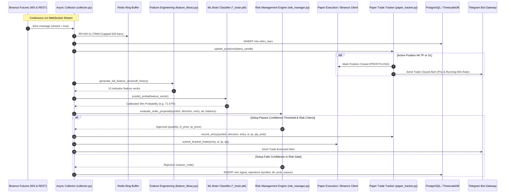
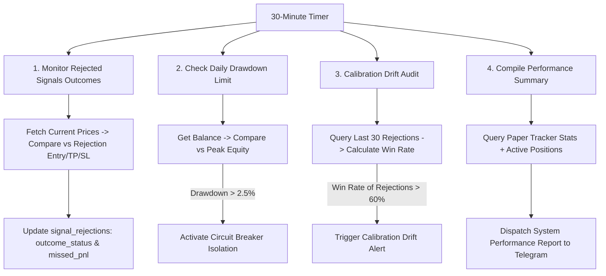

# Current Data Flow Architecture

## 1. End-to-End Data Ingestion & Execution Flow

This document details the real-time data flows across the system components, from exchange feeds to database persistence and telemetry.

---

## 2. Ingestion & Execution Sequence Diagram

---

## 3. Component Data Transformation Pipeline

| Stage | Input Data Structure | Output Data Structure | Latency Profile |
| :--- | :--- | :--- | :--- |
| **1. WebSocket Ingest** | Raw JSON Binance kline payload | Normalized Python dictionary | $< 5\text{ ms}$ |
| **2. Buffer Append** | Candlestick dict `[ts, o, h, l, c, v]` | Redis List (`candles:{symbol}`) | $< 2\text{ ms}$ |
| **3. Feature Extraction** | Pandas DataFrame (150 bars $\times 6$ cols) | 1D Feature Vector (12 floats) | $15 - 35\text{ ms}$ |
| **4. ML Inference** | 1D NumPy array (`1 x 12`) | Win Probability float ($0.0 - 100.0\%$) | $< 3\text{ ms}$ |
| **5. Risk Evaluation** | Candidate dict + Margin Balance | Sized Proposal dict or Rejection Code | $< 1\text{ ms}$ |
| **6. Paper Execution** | Approved Order Specs | Updated `trading_log_paper.csv` row | $< 5\text{ ms}$ |
| **7. Rejection Audit** | Rejection tuple | PostgreSQL `signal_rejections` row | $< 10\text{ ms}$ |
| **8. Telemetry Dispatch** | Formatted Markdown payload | Telegram Bot API HTTPS POST | $150 - 450\text{ ms}$ |

---

## 4. Periodic Background Data Flows

