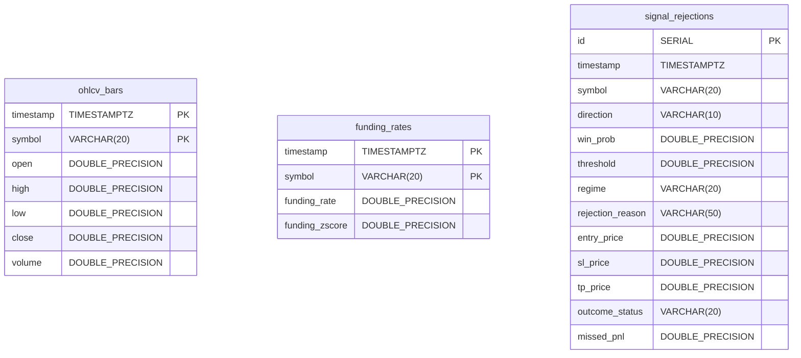

# Current Database Documentation

## 1. Database Overview

The platform uses a hybrid storage architecture:
1. **Redis 7.0**: In-memory high-speed cache for real-time OHLCV circular ring buffers.
2. **PostgreSQL 16 / TimescaleDB**: Persistent relational time-series database (`ai_quant_db`) on port 5432.
3. **Flat-file CSV Logs**: Legacy append-only trade logs (`trading_log_*.csv`).

---

## 2. PostgreSQL / TimescaleDB Schemas



### Table: `ohlcv_bars`
* **Purpose**: Stores historical 1-minute candlestick data.
* **Schema**:
  * `timestamp TIMESTAMPTZ NOT NULL`: UTC bar close timestamp.
  * `symbol VARCHAR(20) NOT NULL`: Normalized asset symbol (e.g. `SOL/USDT`).
  * `open`, `high`, `low`, `close`, `volume DOUBLE PRECISION`: Standard price and volume metrics.
* **Primary Key**: `(timestamp, symbol)`.

### Table: `funding_rates`
* **Purpose**: Tracks historical perpetual funding rates and rolling volatility.
* **Schema**:
  * `timestamp TIMESTAMPTZ NOT NULL`: Funding interval timestamp (every 8 hours).
  * `symbol VARCHAR(20) NOT NULL`: Contract symbol.
  * `funding_rate DOUBLE PRECISION`: Raw funding rate.
  * `funding_zscore DOUBLE PRECISION`: 30-period rolling $Z$-score.
* **Primary Key**: `(timestamp, symbol)`.

### Table: `signal_rejections`
* **Purpose**: Captures all rejected trade setups to monitor missed Expected Value (EV) and calibration drift.
* **Schema**:
  * `id SERIAL PRIMARY KEY`: Unique rejection event identifier.
  * `timestamp TIMESTAMPTZ DEFAULT CURRENT_TIMESTAMP`: Time of rejection.
  * `symbol VARCHAR(20)`, `direction VARCHAR(10)`: Candidate asset and side.
  * `win_prob DOUBLE PRECISION`: Predicted ML model win probability.
  * `threshold DOUBLE PRECISION`: Required confidence threshold.
  * `rejection_reason VARCHAR(50)`: Reason code (e.g., `LOW_PROBABILITY`, `SPREAD_TOO_HIGH`, `MAX_POSITIONS_REACHED`).
  * `entry_price`, `sl_price`, `tp_price DOUBLE PRECISION`: Snapshot price targets.
  * `outcome_status VARCHAR(20)`: Hypothetical outcome (`PENDING`, `HIT_TP`, `HIT_SL`, `EXPIRED`).
  * `missed_pnl DOUBLE PRECISION`: Hypothetical dollar return if the trade had been executed.

---

## 3. Redis In-Memory Ring Buffer Structure

* **Key Format**: `candles:{symbol}` (e.g., `candles:SOL/USDT`).
* **Data Structure**: Redis `LIST` storing JSON strings:
  ```json
  {"timestamp": 1787736900000, "open": 96.35, "high": 96.42, "low": 96.31, "close": 96.38, "volume": 12450.2}
  ```
* **Memory Management**: Fixed-length circular buffer enforced via atomic pipeline:
  ```python
  pipe.rpush(key, json_str)
  pipe.ltrim(key, -500, -1)
  ```
