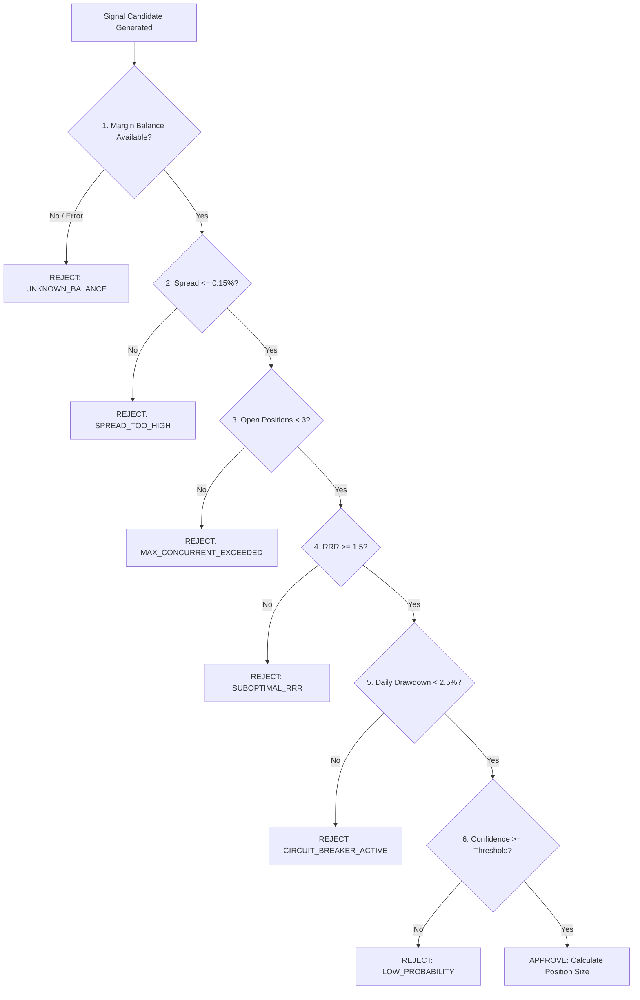

# Current Risk Review & Mathematical Controls

## 1. Quantitative Risk Management Evaluation

Risk management in quantitative trading systems must be **deterministic, mathematically sound, and fail-closed**. This review audits the mathematical constraints and safety mechanisms currently enforced in the codebase.

---

## 2. Risk Control Decision Matrix

---

## 3. Mathematical Specifications & Formulae

### A. Position Sizing Formulation
The system computes trade sizing based on fractional risk of account margin balance:
$$\text{Dollar Risk} = \text{Balance} \times \text{Risk Factor} \times 0.01$$
$$\text{Position Quantity} = \frac{\text{Dollar Risk}}{|\text{Entry Price} - \text{Stop Loss Price}|}$$
$$\text{Approved Quantity} = \text{RoundDownToStepSize}(\min(\text{Position Quantity}, \text{Max Asset Notional Limit}))$$

### B. Dynamic ATR Stop-Loss & Take-Profit Targets
* **Stop Loss**: Placed at a volatility-scaled distance:
  $$\text{SL}_{\text{LONG}} = \text{Entry} - (1.5 \times \text{ATR}_{14})$$
  $$\text{SL}_{\text{SHORT}} = \text{Entry} + (1.5 \times \text{ATR}_{14})$$
* **Take Profit**: Placed to guarantee positive statistical asymmetry:
  $$\text{TP}_{\text{LONG}} = \text{Entry} + (2.25 \times \text{ATR}_{14}) \quad (\text{RRR} = 1.5)$$
  $$\text{TP}_{\text{SHORT}} = \text{Entry} - (2.25 \times \text{ATR}_{14}) \quad (\text{RRR} = 1.5)$$

### C. Daily Drawdown Circuit Breaker
* Evaluates peak margin equity $E_{\text{peak}}$ recorded at 00:00 UTC vs current equity $E_{\text{current}}$:
  $$\text{Drawdown \%} = \frac{E_{\text{peak}} - E_{\text{current}}}{E_{\text{peak}}} \times 100$$
* If $\text{Drawdown \%} \ge 2.5\%$, the circuit breaker trips, sets `is_locked = True`, rejects all new orders for 24 hours, and dispatches a critical Telegram alert.

---

## 4. Fail-Closed Principles in Code
The system adheres to strict fail-closed safety semantics:
1. **Missing or Stale Ticker**: If bid/ask prices cannot be fetched or age exceeds 120s $\rightarrow$ **REJECT**.
2. **Missing Stop Loss**: If order parameters omit an explicit SL target $\rightarrow$ **REJECT**.
3. **Zero Balance Response**: If margin query returns zero or times out $\rightarrow$ **FALLBACK TO SAFE SIMULATION LIMIT**.
4. **Exchange Error**: If an order status response is ambiguous $\rightarrow$ **HALT EXECUTION & DO NOT BLINDLY RETRY**.
