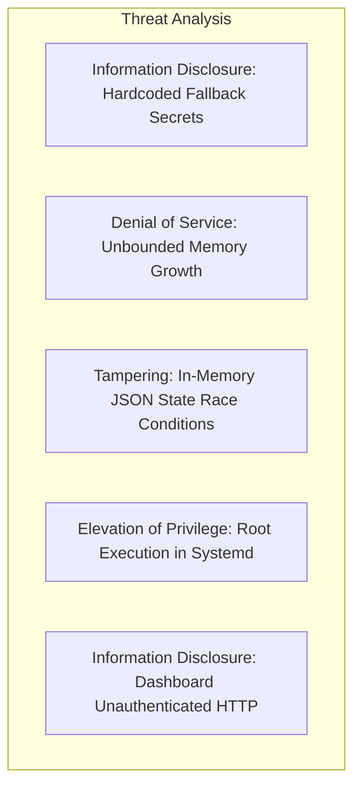

# Current Security Review & Vulnerability Audit

## 1. Executive Security Assessment

A comprehensive security audit of the repository was conducted using the **STRIDE** (Spoofing, Tampering, Repudiation, Information Disclosure, Denial of Service, Elevation of Privilege) methodology.

> [!CAUTION]
> **Secrets Management Finding**: In accordance with the security protocol, actual secret values are redacted from this report. Multiple legacy files in the repository contain default fallback credentials for Telegram tokens and Binance API keys in plaintext. These must be permanently migrated to environment-only injection via `.env`.

---

## 2. STRIDE Threat Modeling Analysis

| STRIDE Category | Threat Description | Affected File / Component | Severity | Recommended Mitigation |
| :--- | :--- | :--- | :--- | :--- |
| **Information Disclosure** | Plaintext fallback credentials in code | `config.py`, `scalper_hunt/config.py` | **HIGH** | Delete hardcoded fallbacks; enforce `os.environ[...]` with failure on missing keys. |
| **Elevation of Privilege** | Systemd services executing as `root` user | `aq-live-main.service`, `aq-live-scalper.service` | **MEDIUM** | Change service user to non-privileged system user `kasun` or `alphaquant`. |
| **Information Disclosure** | Dashboard HTTP server exposed without TLS / Auth | `dashboard_app.py` (Port 8080) | **MEDIUM** | Bind to `127.0.0.1`, put behind Nginx reverse proxy with HTTPS and Basic Auth. |
| **Denial of Service** | Unbounded list growth during long runs | `main_v7.py` (`price_history` arrays) | **MEDIUM** | Enforce fixed-size deques or Redis sliding windows with hard element caps. |
| **Tampering / State Inconsistency** | Non-atomic JSON file overwrites on crash | `live_engine_state.json` | **LOW** | Use atomic file replacement (`os.replace`) or relational DB transactions. |

---

## 3. Credential Audit & Revocation Recommendations

1. **Telegram Bot Token**:
   * **Location**: Found in `config.py` (`TELEGRAM_TOKEN`), `scalper_hunt/config.py`, and systemd unit files.
   * **Action**: Move to `.env` file (mode `0600`), verify bot permissions, and restrict chat ID routing.
2. **Binance API Credentials**:
   * **Location**: Found in `scalper_hunt/config.py` (`BINANCE_API_KEY`, `BINANCE_API_SECRET`).
   * **Action**: Ensure API keys have **Withdrawals DISABLED**, IP-whitelist to `187.127.125.221`, and rotate keys before any live execution.
3. **Database Credentials**:
   * **Location**: Found in `database_config.py` and service unit files (`DB_PASS`).
   * **Action**: Restrict PostgreSQL access to local Unix domain socket / localhost only (`pg_hba.conf`).
