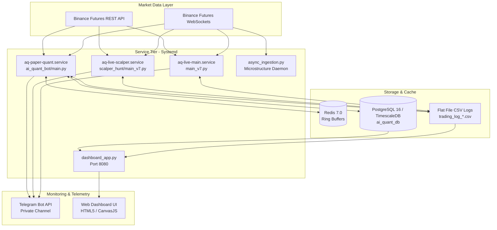
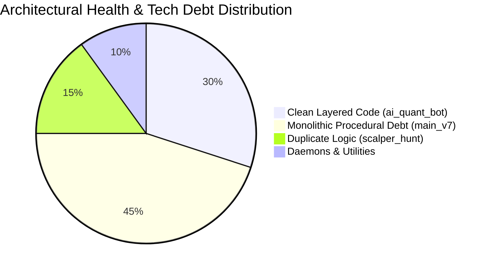

# Current System Architecture Overview

## 1. Architectural Landscape

The current codebase represents a multi-generational quantitative trading repository with three co-existing bot architectures deployed across the host server:

---

## 2. Inventory of Current Components

| Component | Physical Path | Primary Role | Execution Engine | Status |
| :--- | :--- | :--- | :--- | :--- |
| **Bot 1: Main Engine** | `main_v7.py` | 15m Trend & Reversion Strategy | Procedural Async Loop | Active (Demo / Testnet) |
| **Bot 2: Scalper Hunt** | `scalper_hunt/main_v7.py` | 15m Fast Scalping Variant | Procedural Async Loop | Active (Demo / Testnet) |
| **Bot 3: Paper Quant** | `ai_quant_bot/main.py` | 1m Async WebSocket Paper Engine | Layered Async Engine | Active (Simulated Paper) |
| **Feature Generator** | `feature_generator_v7.py` | Batch Feature Vector Processing | Pandas / NumPy | Active (Offline/Daemon) |
| **Async Ingestion** | `async_ingestion.py` | Tick, Liquidation, & OI Ingestion | WebSocket Pipeline | Active Daemon |
| **Web Dashboard** | `dashboard_app.py` | Multi-Bot Analytics HTTP Server | Python `http.server` | Active (Port 8080) |
| **Auto Trainer** | `auto_trainer_daemon.py` | Periodic ML Model Retraining | Scikit-Learn / XGBoost | Active Daemon |

---

## 3. Current Data Ingestion & Storage Topology

1. **Redis In-Memory Tier**:
   * Utilized by `ai_quant_bot` to store circular candlestick ring buffers under keys `candles:{symbol}`.
   * Capped via atomic Redis pipelines executing `RPUSH` followed by `LTRIM key -500 -1`.
2. **PostgreSQL / TimescaleDB Tier**:
   * Database: `ai_quant_db` (hosted locally on port 5432).
   * Tables:
     * `ohlcv_bars`: Stores normalized 1-minute historical candlestick data.
     * `funding_rates`: Historical 8-hour funding rates and calculated $Z$-scores.
     * `signal_rejections`: Audit table capturing every rejected trade candidate, rejection category, win probability, and forward-tested hypothetical outcome.
3. **CSV Flat File Tier**:
   * `trading_log_v8.csv`: Trade execution log for AlphaQuant V8.2 (Live Main).
   * `trading_log_scalper.csv`: Trade execution log for SCALPER_HUNT.
   * `trading_log_paper.csv`: Real-time trade log for the Paper Quant engine.
   * `trading_features_v8.csv`: Raw feature matrix dump for executed trades.

---

## 4. Current Execution & Telemetry Topology

* **Telegram Confirmation & Alerting Gateway**:
  * Utilizes Telegram Bot API (`https://api.telegram.org/bot<TOKEN>/`) via synchronous `requests.post` or async `loop.run_in_executor`.
  * Alerts include Trade Proposals, Execution Confirmations, Trade Close/PnL summaries, System Performance Reports, and Watchdog health pings.
* **Web Dashboard**:
  * Standalone HTTP server listening on `0.0.0.0:8080`.
  * Provides REST API endpoints (`/api/stats`, `/api/trades`, `/api/performance`, `/api/rejections`) that dynamically parse CSV logs and PostgreSQL tables.

---

## 5. Architectural Health Assessment

* **Strengths**: High computational performance, zero external framework overhead, direct CCXT integration, and resilient Redis buffer architecture in Bot 3.
* **Weaknesses**: Significant code duplication between `main_v7.py` and `scalper_hunt/main_v7.py`, tight coupling of alerting with strategy execution, and lack of unified configuration management.
