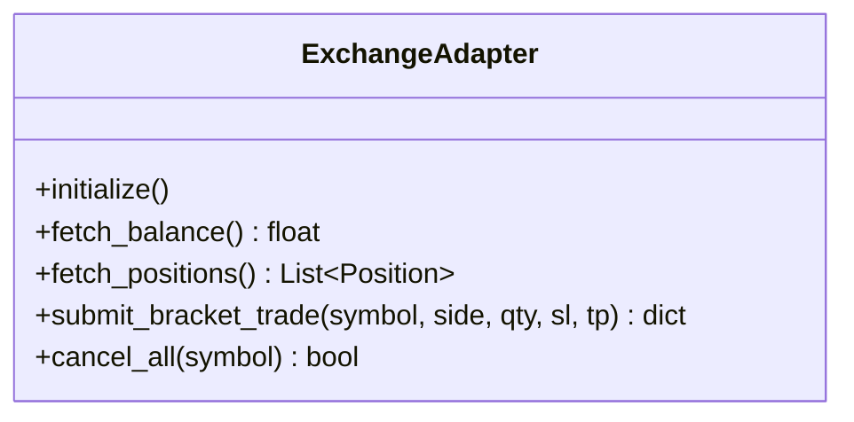

# Exchange Integration & Adapter Specifications

## 1. CCXT Binance Futures Integration

The exchange layer communicates with Binance USDⓈ-M Futures via the CCXT / CCXT Pro library with unified method wrappers:

---

## 2. API Credentials & Permission Requirements

* **Required Permissions**: `Enable Futures` (Read & Trade).
* **Strictly Prohibited Permissions**: `Enable Withdrawals` (Must be **DISABLED**).
* **IP Whitelist**: Enforced on Binance API management console to host IP `187.127.125.221`.
* **Rate-Limit Throttling**: CCXT's built-in `enableRateLimit: true` token-bucket rate limiter is activated on all client instances.

---

## 3. Precision, Lot Size, & Step Rules

Before order dispatch, quantities and prices are rounded using Binance exchange market metadata (`market_info`):
* `Price Precision`: Truncated to tick size (e.g. `0.01` for SOL, `0.0001` for NEAR).
* `Quantity Precision`: Truncated to step size (e.g. `0.1` for SOL, `1.0` for DOGE).
* `Min Notional Filter`: Ensures `Quantity * Entry Price >= 5.0 USD` (Binance Futures minimum order value requirement).
