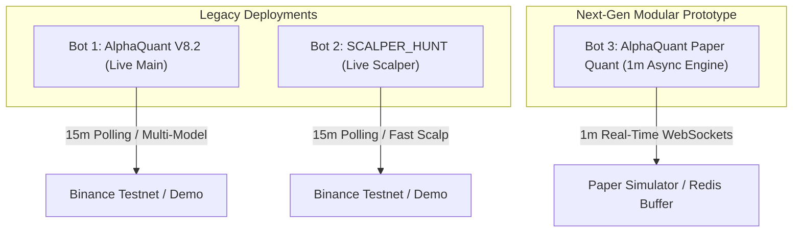
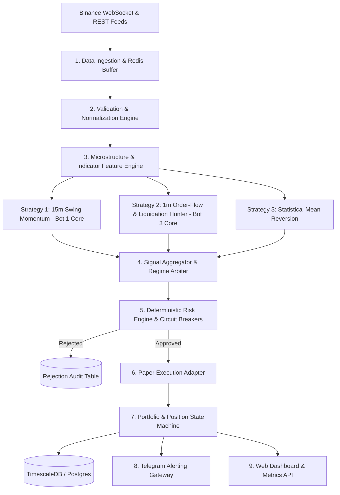

# Executive Summary: AlphaQuant Trading Platform Technical Audit

## 1. Context & Purpose

This document provides an executive-level architectural review and performance evaluation of the **AlphaQuant** cryptocurrency trading-signal repository. 

The primary objective of this quantitative system is to ingest high-frequency market data from cryptocurrency derivatives exchanges (specifically Binance USDⓈ-M Futures), calculate statistical and machine learning features, identify directional trade setups across supported perpetual contracts, enforce strict risk and portfolio constraints, and deliver actionable signal telemetry via Telegram and an interactive web dashboard.

> [!IMPORTANT]
> **Deterministic Risk Over Speculation**: The platform is explicitly designed as a measurable, risk-controlled quantitative research and signal execution engine. It does not promise profits, guarantee returns, or act as an unconstrained automated trading system. All systems operate in `SIGNAL_ONLY` or `PAPER_TRADING` by default.

---

## 2. Current Multi-Bot Landscape

The repository contains three co-existing bot implementations that evolved across different project phases:

### Bot 1: AlphaQuant V8.2 (`main_v7.py`)
* **Architecture**: Monolithic, multi-threaded script operating on a 15-minute polling loop with background WebSocket streams.
* **Core Strength**: Robust trend-following and mean-reversion rule triggers backed by calibrated XGBoost classifiers.
* **Performance Record (Aug 08 – Aug 25, 2026)**: **71.11% Win Rate** across 45 completed trades, generating **+$73.21 USD Net PnL** with a **Profit Factor of 3.42** (operating on small lot testlot sizing).
* **Limitation**: High coupling between data ingestion, strategy logic, order routing, and Telegram alerting inside a single 1,450-line file.

### Bot 2: SCALPER_HUNT (`scalper_hunt/main_v7.py`)
* **Architecture**: Forked variant of V8.2 tailored for short-duration scalping setups with tighter Take Profit (0.2% - 0.5%) targets.
* **Performance Record (Aug 17 – Aug 23, 2026)**: **47.17% Win Rate** across 53 completed trades, resulting in a **-$2.11 USD Net PnL** with a **Profit Factor of 0.62**.
* **Limitation**: Suffers from execution friction, taker fee drag, and sudden market wicks prematurely triggering tight stop losses.

### Bot 3: AlphaQuant Paper Quant (`ai_quant_bot/`)
* **Architecture**: Asynchronous, modular Python package utilizing `ccxt.pro`, Redis Ring Buffers, TimescaleDB/PostgreSQL persistence, and non-blocking Telegram confirmation gates.
* **Core Strength**: Sub-second event processing on 1-minute closed candles, structured risk engine, automated circuit breakers, and zero lookahead bias.
* **Performance Record (Aug 24 – Aug 26, 2026)**: **41.48% Win Rate** across 135 completed forward-tested paper trades, resulting in **+$0.11 USD Net PnL** (flat breakeven).
* **Key Finding**: Validated that retail technical indicators (RSI, Moving Averages, MACD) on a 1-minute timeframe have low signal-to-noise ratios. Real high-frequency alpha requires **pure market microstructure** (order flow, Cumulative Volume Delta, liquidation cascades, and Level 2 depth).

---

## 3. Major Differences & Comparative Findings

| Attribute | Bot 1 (AlphaQuant V8.2) | Bot 2 (SCALPER_HUNT) | Bot 3 (AlphaQuant Paper Quant) |
| :--- | :--- | :--- | :--- |
| **Location** | Root directory (`main_v7.py`) | `scalper_hunt/main_v7.py` | `ai_quant_bot/` |
| **Design Pattern** | Monolithic Procedural | Monolithic Procedural (Fork) | Modular Layered Package |
| **Timeframe** | 15-Minute Candles | 15-Minute Fast Scan | 1-Minute Real-Time WebSockets |
| **Execution Trigger** | Rule-Based (EMA / BB Crossover) $\rightarrow$ ML | Rule-Based $\rightarrow$ Scalp ML | ML Scoring on Every Bar $\rightarrow$ Risk Gate |
| **Concurrency** | `asyncio` + Blocking REST threads | `asyncio` + Blocking REST threads | Pure Async Event Loop |
| **In-Memory Cache** | In-memory Python lists | In-memory Python lists | Redis Ring Buffer (Pruned to 500 bars) |
| **Database** | SQLite + Raw Postgres inserts | SQLite + Raw Postgres inserts | SQLAlchemy ORM + TimescaleDB |
| **Default Mode** | Demo (Testnet) | Demo (Testnet) | Automated Paper Simulation |

---

## 4. Key Risks & Weaknesses Identified

1. **Indicator Lag on Lower Timeframes**: Using standard retail momentum indicators on 1m candles creates whipsaws and false breakout signals (41.48% win rate on Bot 3).
2. **Hardcoded Secrets in Legacy Files**: Legacy scripts contain default fallback API keys and tokens in configuration files rather than enforcing strict environment-only injection.
3. **Execution Fee Drag on Scalping**: High-frequency setups with tight take-profits suffer from exchange maker/taker fee erosion unless fee-adjusted positive expectancy is mathematically modeled.
4. **Memory Management**: Monolithic scripts lack explicit buffer boundaries on long-running historical arrays, leading to OOM killer terminations under tight RAM constraints without active swap space.

---

## 5. Recommended Unified Architecture

We propose unifying the strengths of all three systems into a **Unified Modular Quantitative Signal Platform**:

### Core Architecture Pillars:
1. **Strategy Pluggability**: Treat all strategies as isolated, testable modules implementing a common `Strategy` interface.
2. **Deterministic Risk Management**: Enforce fail-closed controls (max 1% risk per trade, max 3 open positions, 2.5% daily drawdown circuit breaker).
3. **High-Fidelity Paper Trading**: Simulate orders with realistic slippage, maker/taker fees, and exchange latency before any capital deployment.
4. **Microstructure-First Quantitative Features**: Replace lagging indicators on lower timeframes with real-time Cumulative Volume Delta (CVD), Open Interest (OI) velocity, and liquidation cascade detection.

---

## 6. Current Deployment Safety Status

* **Live Real-Money Trading**: **100% DISABLED**. All systems are strictly configured in Demo (Testnet) or Simulation mode.
* **Safe for Production**:
  * Telemetry, historical data ingestion, and PostgreSQL schema.
  * 15-minute signal evaluation and Telegram reporting.
  * Paper trading simulation and performance tracking.
* **Not Ready for Live Real-Money Trading**:
  * Low-timeframe 1m indicator models (requires retraining on microstructure features).
  * Automated order routing without hardware-isolated API keys.

---

## 7. Next Five Development Priorities

1. **Security Hardening**: Strip all hardcoded fallback credentials and implement strict environment-only configuration loading via `.env`.
2. **Pure Microstructure Feature Engineering**: Integrate `async_ingestion.py` order flow, tick trades, and liquidation streams into `FeatureEngineering`.
3. **Strategy Unification**: Refactor Bot 1's 15m Shotgun Momentum and Bot 3's real-time engine into standalone strategy classes behind a unified `SignalAggregator`.
4. **Comprehensive Automated Test Suite**: Implement unit and integration test coverage for risk calculations, feature math, and order state transitions.
5. **Web Dashboard & Metrics Hardening**: Connect the Prometheus/Grafana and Web Dashboard to the unified paper trading log for real-time executive visibility.
