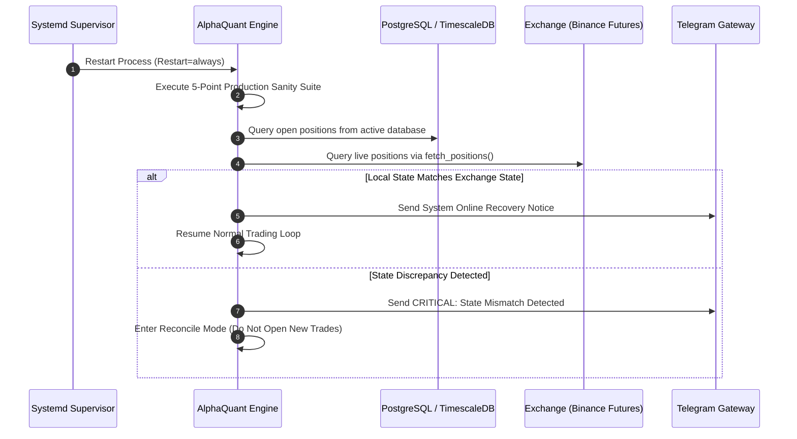

# Failure Recovery & State Reconstruction

## 1. System Crash & Unexpected Restart Recovery

When an unexpected host reboot, process crash, or network outage occurs, the platform automatically executes a **State Reconstruction Protocol**:

---

## 2. Recovery Procedures for Specific Failure Modes

### A. Database Connection Loss
* **Behavior**: Application intercepts `asyncpg.PostgresConnectionError` or `psycopg2.OperationalError`.
* **Action**: Falls back to in-memory buffering and local CSV appending; retries DB reconnection every 10s with exponential backoff up to 60s.

### B. WebSocket Feed Disconnection
* **Behavior**: `WebSocketWatchdog` detects no activity on a symbol stream for $> 120\text{s}$.
* **Action**: Automatically terminates the stale socket, fetches backfill bars via REST, and establishes a fresh WebSocket listener.

### C. Exchange API Outage / HTTP 5xx
* **Behavior**: CCXT raises `ExchangeNotAvailable` or `RequestTimeout`.
* **Action**: Never retries blindly. Marks exchange health as degraded, skips current inference cycle, and awaits healthy ping response.
