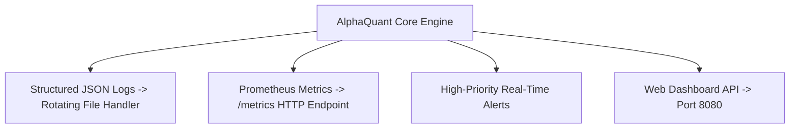

# Observability & Telemetry Architecture

## 1. Observability Architecture Overview

The system implements a three-pillar observability framework comprising Structured Logging, Prometheus Metrics, and Dashboard Visualization:



---

## 2. Structured JSON Logging Specification

All log events are written using Python's standard `logging` library configured with rotating file handlers (`LOG_MAX_BYTES = 50 * 1024 * 1024` / 50MB, `LOG_ROTATION_BACKUPS = 5`):

```json
{
  "timestamp": "2026-08-26T09:35:11.245Z",
  "level": "INFO",
  "logger": "ai_quant_bot.execution.paper_tracker",
  "event": "TRADE_CLOSED",
  "trade_id": "sim_1787736911_SOL_USDT",
  "symbol": "SOL/USDT",
  "direction": "SHORT",
  "outcome": "PROFIT",
  "entry_price": 96.35,
  "exit_price": 96.186,
  "pnl_usd": 0.0492,
  "running_win_rate_pct": 71.11
}
```

---

## 3. Core Operational Metrics

* `alphaquant_trades_total{symbol, direction, status}`: Counter of total executed/simulated trades.
* `alphaquant_realized_pnl_usd{symbol}`: Cumulative realized PnL in USD.
* `alphaquant_open_positions_count`: Gauge of currently active market positions.
* `alphaquant_websocket_latency_seconds`: Gauge of Binance WebSocket message lag.
* `alphaquant_circuit_breaker_status`: Boolean gauge indicating if emergency drawdown isolation is tripped.
