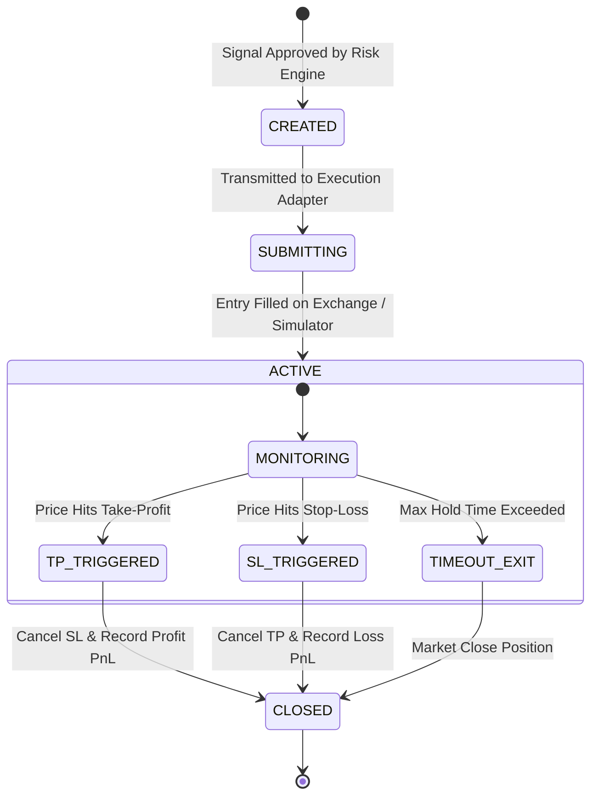

# Order Execution & Bracket Lifecycle

## 1. Bracket Order Execution Protocol

All trades are submitted as **atomic compound bracket structures** consisting of:
1. **Entry Order**: Market or Limit order at the entry target price.
2. **Stop-Loss Protection Order**: `STOP_MARKET` order placed immediately upon entry confirmation.
3. **Take-Profit Target Order**: `TAKE_PROFIT_MARKET` or Limit order linked via One-Cancels-the-Other (OCO) logic.

---

## 2. Order Execution State Machine States

* `CREATED`: Order object initialized and validated in memory.
* `SUBMITTING`: Order payload sent to exchange or paper engine.
* `ACTIVE`: Position open with verified stop-loss and take-profit orders in place.
* `CLOSED`: Position completely resolved with realized PnL recorded in database and CSV logs.
* `RECONCILING`: State mismatch detected between local state and exchange; halts execution until verified.
