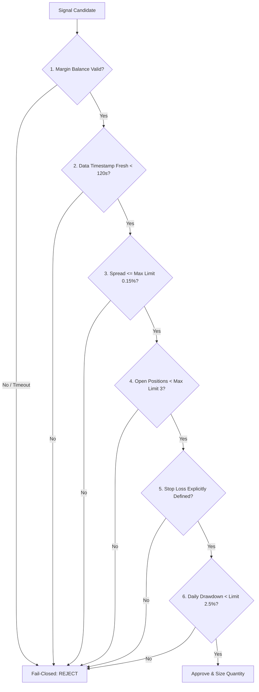

# Deterministic Risk Management Engine

## 1. Core Risk Philosophy: Fail-Closed Architecture

The risk management layer acts as an immutable, non-bypassable gatekeeper between strategy signal generation and execution. It enforces hard mathematical constraints and fails closed under all error conditions.



---

## 2. Hard Risk Limits Catalog

| Limit Category | Threshold Parameter | Enforcement Action |
| :--- | :--- | :--- |
| **Max Risk Per Trade** | `1.0%` of margin equity | Position sized strictly by stop loss distance |
| **Max Portfolio Risk** | `3.0%` cumulative exposure | Rejects new setups if cumulative risk exceeds 3% |
| **Max Concurrent Positions** | `3` open positions | Blocks new entries until an existing position closes |
| **Max Bid-Ask Spread** | `0.15%` | Rejects entries during wide spread / illiquid periods |
| **Min Risk-to-Reward (RRR)** | `1.5:1.0` | Rejects setups where TP distance $< 1.5 \times \text{SL distance}$ |
| **Daily Drawdown Limit** | `2.5%` daily loss from 00:00 UTC peak | Trips circuit breaker, halts trading for 24h |
| **Max Consecutive Losses** | `4` consecutive stop-outs | Triggers 6-hour cooldown period |
| **Data Freshness Limit** | `120` seconds | Rejects signals if market feed is stale |

---

## 3. Formal Risk Decision Object Contract

Every evaluation produces a deterministic decision dictionary:

```json
{
  "allowed": true,
  "approved_quantity": 0.45,
  "reasons": ["Signal passes all risk constraints", "Sizing within asset notional cap"],
  "rejection_codes": [],
  "limits_applied": {
    "risk_pct": 1.0,
    "dollar_risk": 10.0,
    "sl_distance": 1.45,
    "spread_pct": 0.02
  },
  "risk_snapshot": {
    "margin_balance": 1000.0,
    "open_positions_count": 1,
    "current_daily_drawdown_pct": 0.35,
    "circuit_breaker_active": false
  }
}
```
