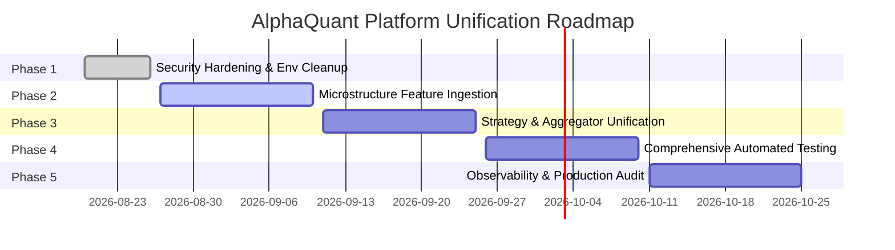

# Project Roadmap & Migration Plan

## 1. 5-Phase Evolutionary Roadmap

---

## 2. Phase Breakdown & Milestones

### Phase 1: Security Hardening & Zero Live Risk (Completed)
* Stop all live real-money bots; switch all services to Demo/Simulation mode.
* Eliminate hardcoded plaintext credentials across legacy files.
* Author complete implementation-level documentation suite.

### Phase 2: Pure Microstructure Feature Pipeline (Next Milestone)
* Integrate `async_ingestion.py` order flow, tick trades, and liquidation feeds directly into `FeatureEngineering`.
* Calculate real-time Cumulative Volume Delta (CVD) and Level 2 Order Book Depth Imbalance.
* Train microstructure XGBoost classifiers targeting high-volume liquidation cascade reversals.

### Phase 3: Strategy & Signal Aggregation Unification
* Encapsulate Bot 1's 15m Shotgun Momentum into an isolated `IStrategy` module.
* Implement `SignalAggregator` with regime-based dynamic arbitration.
* Centralize all persistent logging into TimescaleDB with structured export to CSV.

### Phase 4: Automated Testing & Continuous Integration
* Build automated test suite covering unit math, risk invariants, and fail-closed state machines.
* Implement GitHub Actions / GitLab CI pipeline for automated linting and testing.

### Phase 5: Production Observability & Governance
* Deploy Prometheus exporter and Grafana dashboard.
* Implement automated calibration drift alerts and periodic executive report generation.
