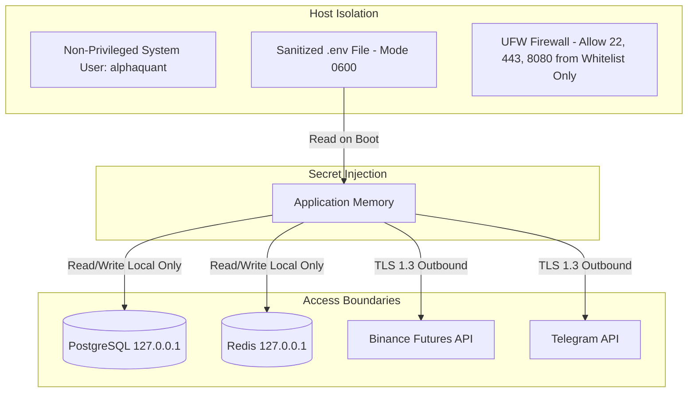

# Target Security Architecture & Hardening Guide

## 1. Zero-Trust Security Architecture

The target security architecture enforces strict separation of privileges, secure credential management, network isolation, and non-privileged daemon execution:

---

## 2. Hardening Standards

1. **Non-Root Execution**: All systemd services must execute under a dedicated `alphaquant` system user with `NoNewPrivileges=true` and `ProtectSystem=strict`.
2. **Secrets Storage**:
   * API keys and database passwords must reside strictly in an untracked `.env` file with POSIX permissions `chmod 600 .env`.
   * The repository `.gitignore` must strictly prohibit committing `.env`, `*.pem`, `*.key`, or credentials.
3. **Network & Firewall**:
   * PostgreSQL (port 5432) and Redis (port 6379) must bind exclusively to `127.0.0.1` and reject external ingress.
   * Web Dashboard (port 8080) should be reverse-proxied via Nginx with HTTPS (Let's Encrypt SSL) and HTTP Basic Authentication.
