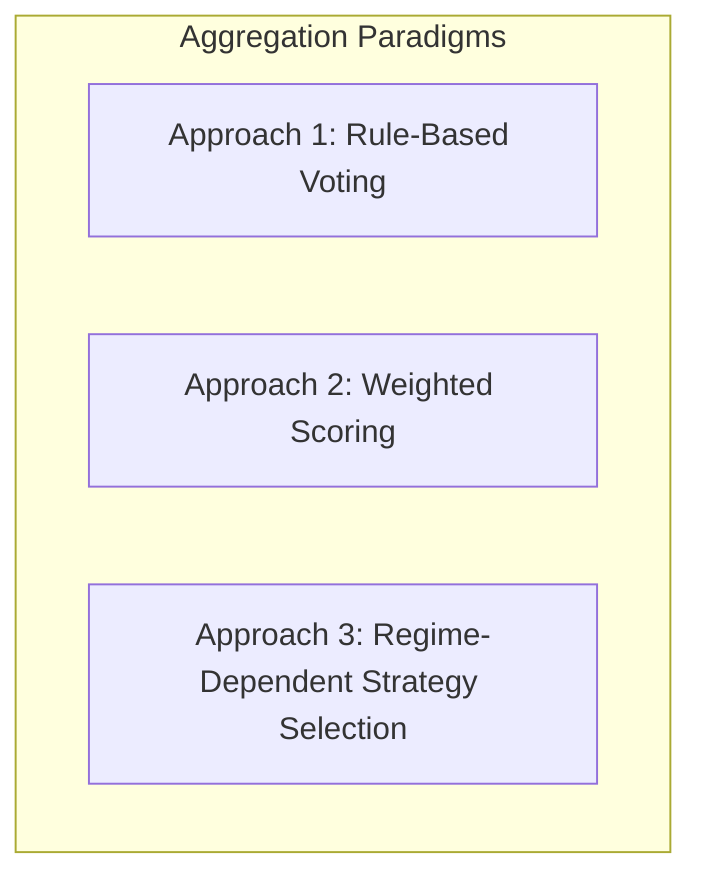

# Signal Aggregation & Multi-Strategy Arbitration

## 1. Aggregation Problem Statement
When multiple quantitative strategies evaluate market data concurrently, they may produce duplicate, conflicting (one LONG, one SHORT), or correlated signals on the same asset. The `SignalAggregator` arbitrates these candidates into a single, cohesive signal decision.

---

## 2. Evaluation of Aggregation Approaches

### Approach 1: Rule-Based Majority Voting
* **Mechanism**: Counts votes (LONG vs SHORT). If votes $\ge 2$ and conflicting votes $= 0$, approve majority side.
* **Limitations**: Treats all strategies equally regardless of market regime or historical track record.

### Approach 2: Weighted Scoring
* **Mechanism**: Multiplies strategy confidence by historical Sharpe ratio or calibrated probability weights:
  $$\text{Composite Score} = \sum_{i=1}^{n} w_i \times \text{Confidence}_i$$
* **Limitations**: Can still generate false signals if trend strategies trade during choppy consolidating regimes.

### Approach 3: Regime-Dependent Strategy Selection (Recommended)
* **Mechanism**: Classifies market regime first using Choppiness Index ($\text{CI}_{14}$) and ADX ($\text{ADX}_{14}$), then dynamically routes authority to the strategy specialized for that regime:
  * If $\text{ADX}_{14} \ge 25.0 \text{ and } \text{CI}_{14} \le 45.0 \rightarrow$ **TREND REGIME** $\rightarrow$ Authority given to `ShotgunMomentumStrategy`.
  * If $\text{CI}_{14} \ge 55.0 \rightarrow$ **RANGE REGIME** $\rightarrow$ Authority given to `StatisticalMeanReversionStrategy`.
  * If High Liquidation Volume Detected $\rightarrow$ **VOLATILITY SPIKE** $\rightarrow$ Authority given to `LiquidationCascadeStrategy`.
* **Recommendation Rationale**: Eliminates conflicting signals by matching strategy hypotheses directly with prevailing market dynamics.

---

## 3. Conflict Resolution & Neutral Fallback Rules
* If two strategies propose opposite directions within the same regime $\rightarrow$ **Return `NEUTRAL` (No Trade)**.
* If aggregate confidence is below the asset's required threshold $\rightarrow$ **Return `NEUTRAL`**.
* The aggregator **never forces a trade**. Preserving capital is the default state.
