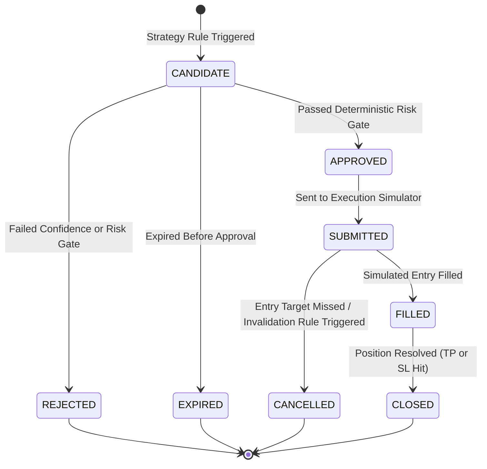

# Signal Generation & Invalidation Lifecycle

## 1. Signal Candidate Lifecycle State Machine

Signals transition through a formal lifecycle from generation to final execution or expiration:

---

## 2. Signal Generation Pre-Conditions

A strategy module may only produce a candidate signal if:
1. **Timestamp Freshness**: The latest bar timestamp matches the expected current period ($< 120\text{s}$ old).
2. **Sufficient Historical Warm-Up**: A minimum of 150 valid historical candlestick bars are loaded in memory.
3. **No Zero Values**: All required indicators are non-null and non-zero.
4. **Market Open**: The target perpetual contract is actively trading and not in maintenance mode.

---

## 3. Invalidation Rules

An active approved signal is invalidated and cancelled if:
1. **Time Invalidation**: The current candle closes without the price reaching the defined `entry_zone` (`expires_at` reached).
2. **Structural Invalidation**: The price breaches the `stop_loss` level *prior* to filling the `entry_zone` (invalidating the setup structure).
3. **Regime Shift Invalidation**: The market regime changes from `TREND` to `VOLATILE` or `CHOPPY` before entry fill.
