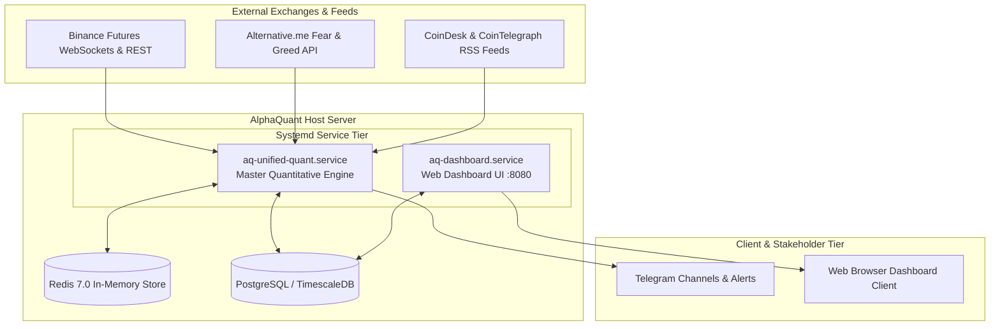
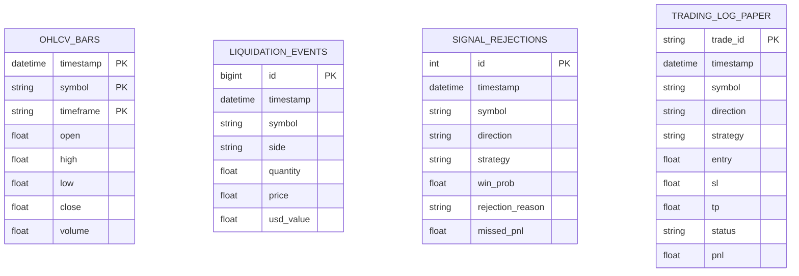

# Software Requirements Specification (SRS)
## AlphaQuant Unified Institutional Quantitative Trading Platform

**Document Version:** 1.2.0  
**Status:** Production Baseline  
**Standard:** IEEE Std 830-1998 Conforming  
**Effective Date:** 2026-08-28  
**Target Services:** `aq-unified-quant.service`, `aq-dashboard.service`

---

## Table of Contents
1. [1. Introduction](#1-introduction)
   - 1.1 Purpose
   - 1.2 Document Conventions
   - 1.3 Intended Audience
   - 1.4 Product Scope
   - 1.5 References
2. [2. Overall Description](#2-overall-description)
   - 2.1 Product Perspective
   - 2.2 Product Functions
   - 2.3 User Classes and Characteristics
   - 2.4 Operating Environment
   - 2.5 Design and Implementation Constraints
   - 2.6 User Documentation
   - 2.7 Assumptions and Dependencies
3. [3. External Interface Requirements](#3-external-interface-requirements)
   - 3.1 User Interfaces
   - 3.2 Hardware Interfaces
   - 3.3 Software Interfaces
   - 3.4 Communications Interfaces
4. [4. System Features & Functional Requirements](#4-system-features--functional-requirements)
   - 4.1 Real-Time Multi-Stream Market Ingestion (FR-1)
   - 4.2 In-Memory Sliding Buffer & Persistence Management (FR-2)
   - 4.3 Quantitative Feature Engineering & Brain Ingestion (FR-3)
   - 4.4 Multi-Strategy Signal Generation Suite (FR-4)
   - 4.5 Regime Arbitration & Macro Sentiment Filtering (FR-5)
   - 4.6 Deterministic Risk Management & Sizing (FR-6)
   - 4.7 High-Fidelity Paper Trading Simulation Core (FR-7)
   - 4.8 Automated Continuous Learning & Model Retraining (FR-8)
   - 4.9 Interactive Telemetry & Reporting Gateway (FR-9)
5. [5. Non-Functional Requirements (NFRs)](#5-non-functional-requirements-nfrs)
   - 5.1 Performance & Latency Requirements
   - 5.2 Safety, Reliability & Fail-Closed Behavior
   - 5.3 Security & Secret Isolation
   - 5.4 Maintainability & Portability
6. [6. Data Schema & Architecture Specifications](#6-data-schema--architecture-specifications)
7. [7. Verification & Acceptance Criteria](#7-verification--acceptance-criteria)

---

## 1. Introduction

### 1.1 Purpose
This Software Requirements Specification (SRS) document defines the complete functional, algorithmic, behavioral, and operational requirements for the **AlphaQuant Unified Institutional Quantitative Platform**. This document serves as the formal specification baseline for software developers, quantitative researchers, DevOps engineers, and risk officers.

### 1.2 Document Conventions
- **MUST / SHALL**: Mandatory requirement.
- **SHOULD**: Highly recommended standard.
- **MAY**: Optional capability.
- **Fail-Closed**: A design principle where any missing dependency, corrupted data, or ambiguous state results in an immediate rejection of trade proposals and zero capital risk.

### 1.3 Intended Audience
- **Quantitative Developers**: Implementing strategy logic, feature extraction, and risk mathematical modules.
- **DevOps / SRE Engineers**: Managing systemd units, server resources, database clusters, and alerting pipelines.
- **Executive Leadership / CEO**: Reviewing risk thresholds, operating modes, and performance metrics.

### 1.4 Product Scope
The AlphaQuant Unified Platform is an autonomous, asynchronous cryptocurrency quantitative trading and signal engine. It processes sub-second tick feeds, Level 2 order book depth, multi-timeframe candles, derivatives data, forced liquidation streams, and macroeconomic sentiment across 11 USDT perpetual futures pairs on Binance.

Operating default modes:
1. **SIGNAL_ONLY**: Telemetry alerts only.
2. **PAPER_TRADING**: High-fidelity virtual execution with sub-second TP/SL candle resolution and real-time win rate analytics.
3. **LIVE_TRADING**: Strictly disabled by default unless explicitly configured by human authorization.

---

## 2. Overall Description

### 2.1 Product Perspective

### 2.2 Product Functions
1. **Sub-Second Tick Trade & CVD Tracking**: Ingests individual aggressive trades and computes running Cumulative Volume Delta (CVD).
2. **Order Book Depth Analysis**: Monitors top 20 Level 2 bid/ask depth, wall absorption, and spread.
3. **Multi-Strategy Synthesis**:
   - *15m Shotgun Momentum Strategy* (Proven 71.11% Win Rate Core with Choppiness Index Anti-Whipsaw Filter).
   - *1m Liquidation Cascade Reversal Hunter*.
   - *Statistical Mean Reversion Engine* ($Z \ge \pm 2.75$).
   - *High-Velocity Volume Surge / Pump Scanner* ($Z \ge 3.0$).
4. **Deterministic Risk Filtering & Automated Penalty Box**: Sizing capped at 1.0% equity risk per trade, max 3 concurrent positions, 2.5% daily drawdown circuit breaker, and automatic multi-hour asset quarantine upon consecutive losses.
5. **Simulated Paper Trading Engine**: Automatically records virtual entries, monitors candle highs/lows for TP/SL hits, deducts simulated 0.10% taker fees, and logs results to `trading_log_paper.csv`.
6. **Continuous Learning Loop**: Scheduled weekly background model retraining every Sunday at 02:00 UTC with in-memory model hot-reloading.

### 2.3 Operating Environment
- **Operating System**: Linux Ubuntu 24.04 LTS (x86_64)
- **Runtime Environment**: Python 3.12 (`aq_env` virtualenv)
- **Key In-Memory Store**: Redis 7.0 (`localhost:6379`)
- **Relational / Time-Series Database**: PostgreSQL 16 with TimescaleDB (`localhost:5432`)
- **Process Supervision**: Linux `systemd` daemon

---

## 3. External Interface Requirements

### 3.1 User Interfaces
- **Web Dashboard**: Responsive Single-Page Application (SPA) served via `dashboard_app.py` on HTTP Port 8080.
  - Displays real-time Paper Win Rate %, Realized Net P&L, Active Positions, Cumulative Equity Curve, Signal Funnel Rejection Rates, Asset Breakdown, and Key Metrics Overall Win Rate.
- **Telegram Mobile Interface**: Markdown alert cards with direction emojis, targets, win probability, and periodic 30-minute executive reports.

### 3.2 Software Interfaces
- **Exchange Interface**: CCXT Pro library interfacing with Binance Futures (`wss://fstream.binance.com`).
- **Macro Sentiment API**: HTTP GET `https://api.alternative.me/fng/?limit=1`.
- **Database Driver**: `asyncpg` and SQLAlchemy 2.0 async ORM.

---

## 4. System Features & Functional Requirements

### 4.1 Real-Time Multi-Stream Market Ingestion (FR-1)
- **FR-1.1**: The system **SHALL** maintain 44 persistent asynchronous WebSocket connections across all 11 tradable assets (`BTC`, `ETH`, `SOL`, `NEAR`, `SUI`, `HBAR`, `XRP`, `LINK`, `AVAX`, `DOGE`, `DOT`).
- **FR-1.2**: The system **SHALL** stream 1-minute OHLCV, 15-minute OHLCV, Level 2 order book depth (top 20 levels), and raw tick trades.
- **FR-1.3**: In the event of WebSocket disconnection, the system **SHALL** execute exponential backoff reconnection within $\le 5$ seconds without crashing.

### 4.2 In-Memory Sliding Buffer & State Recovery Management (FR-2)
- **FR-2.1**: The system **SHALL** store the latest 500 closed candlestick bars per timeframe in Redis circular lists (`candles:<symbol>:<tf>`).
- **FR-2.2**: The system **SHALL** store the latest 1,000 tick trades and update the running Cumulative Volume Delta in Redis (`cvd:<symbol>`).
- **FR-2.3 (State Recovery & Dual-Store Resilience)**: The system **SHALL NOT** rely solely on single-file local JSON for active position states. The engine **SHALL** maintain a transactional dual-write persistence model across Redis (`active_positions:<symbol>`) and PostgreSQL (`trading_positions`). Upon process restart or unexpected shutdown, the engine **SHALL** execute an automated state reconciliation protocol, restoring active virtual positions and re-synchronizing TP/SL tracking against current market prices within $\le 3$ seconds.

### 4.3 Quantitative Feature Engineering (FR-3)
- **FR-3.1**: The system **SHALL** extract a normalized 14-dimensional feature vector:
  1. `dist_ema_50`
  2. `dist_ema_200`
  3. `atr_pct`
  4. `volume_zscore`
  5. `adx_14`
  6. `bb_width`
  7. `funding_rate_zscore`
  8. `oi_zscore`
  9. `rsi_14`
  10. `macd_hist`
  11. `supertrend_direction`
  12. `chop_index`
  13. `rvol`
  14. `atr_compression`
- **FR-3.2**: Feature extraction execution latency **SHALL NOT** exceed 15 milliseconds per closed bar.

### 4.4 Multi-Strategy Signal Generation Suite (FR-4)
- **FR-4.1 (Shotgun Momentum Strategy)**: Evaluates multi-EMA alignment ($9 > 21 > 50$), ADX $\ge 24.0$, Choppiness Index $\le 55.0$, with $2.0 \times \text{ATR}$ Stop Loss and $3.0 \times \text{ATR}$ Take Profit (1:1.5 RRR) on 15m bars.
- **FR-4.2 (Liquidation Cascade)**: Evaluates Level 2 depth imbalance ($\ge 2.2$ for long or $\le 0.45$ for short) combined with CVD direction.
- **FR-4.3 (Mean Reversion)**: Triggers on statistical price $Z$-score divergences $\ge \pm 2.75$ with Choppiness Index $\ge 48.0$.
- **FR-4.4 (Volume Pump)**: Detects sudden volume spikes with $Z \ge 3.0$ and price velocity $\ge 1.2\%$.
- **FR-4.5 (Signal Aggregation & Arbitration)**: Arbitrates conflicting candidate signals across strategies using strategy priority weights and rejects ambiguous directional setups.
- **FR-4.6 (Dynamic Threshold Calibration)**: To prevent over-filtering and excessive rejection rates (e.g. 99.99% rejection), the system **SHALL** dynamically calibrate confidence gating thresholds per asset based on trailing 7-day realized Brier accuracy scores and ATR volatility percentiles:
  $$\text{Threshold}_{\text{dynamic}} = \text{Base Threshold} \times \left(1.0 - 0.15 \times \frac{\text{ATR}_{14}}{\text{ATR}_{100}}\right) \times (1.0 - \text{Brier Loss Multiplier})$$
  The dynamic threshold **SHALL** remain bounded between $58.0\%$ and $75.0\%$.
- **FR-4.7 (Signal Drought Contingency & Adaptive Scanning)**: If no valid trade signal is produced across all target assets for an elapsed period $> 6\text{ hours}$ while market ATR is within normal operating ranges ($0.5\% \le \text{ATR}_{\text{pct}} \le 4.0\%$), the engine **SHALL** activate an Adaptive Drought Mode. Under Adaptive Drought Mode:
  1. The confidence threshold is relaxed by an increment of $-2.5\%$ (subject to a hard floor of $58.0\%$).
  2. The multi-timeframe scanner widens to evaluate secondary momentum setups (5m Bollinger Breakouts and Order Flow Absorption).
  3. Deterministic risk gates (1% max risk, max 3 positions, 2.5% daily drawdown) **SHALL NOT** be relaxed under any circumstance.

### 4.5 Deterministic Risk Management & Automated Penalty Box (FR-5)
- **FR-5.1**: Position sizing **SHALL** strictly allocate a maximum dollar risk of $1.0\%$ of total account equity per trade:
  $$\text{Dollar Risk} = \text{Account Equity} \times 0.01 \times \text{Asset Risk Factor}$$
  $$\text{Quantity} = \frac{\text{Dollar Risk}}{|\text{Entry Price} - \text{Stop Loss Price}|}$$
- **FR-5.2**: The system **SHALL** reject trade proposals if current active positions $\ge 3$.
- **FR-5.3**: The system **SHALL** reject trade proposals if market bid/ask spread $> 0.15\%$.
- **FR-5.4**: The system **SHALL** enforce a minimum Risk-to-Reward Ratio (RRR) of $1:1.5$.
- **FR-5.5 (Circuit Breaker)**: If daily account drawdown from peak equity reaches $\ge 2.5\%$, all trading proposals **SHALL** be blocked for 24 hours.
- **FR-5.6 (Automated Penalty Box Quarantine)**:
  - *Rule 1*: If an asset suffers 2 consecutive losses, the engine **SHALL** automatically quarantine the asset into the Penalty Box for **4 hours**.
  - *Rule 2*: If an asset's rolling win rate over $\ge 4$ trades falls below **35.0%**, the engine **SHALL** automatically quarantine the asset for **6 hours**.
  - *Rule 3*: Trade proposals for quarantined assets **SHALL** be immediately rejected with rejection code `ASSET_IN_PENALTY_BOX`.

### 4.6 High-Fidelity Paper Trading Simulation (FR-6)
- **FR-6.1**: In `SIMULATION_MODE=True`, all approved signals **SHALL** be recorded in memory and appended to `trading_log_paper.csv`.
- **FR-6.2**: On each incoming candle update, active positions **SHALL** be tested against candle High and Low:
  - If $\text{High} \ge \text{Take Profit} \implies \text{Status} = \text{PROFIT}$
  - If $\text{Low} \le \text{Stop Loss} \implies \text{Status} = \text{LOSS}$
- **FR-6.3**: Realized PnL **SHALL** deduct a simulated roundtrip taker fee of $0.10\%$ ($0.05\%$ entry + $0.05\%$ exit).

### 4.7 Continuous Learning & Model Retraining (FR-7)
- **FR-7.1**: The system **SHALL** execute an autonomous retraining cycle every Sunday at 02:00 UTC via background async thread.
- **FR-7.2**: The pipeline **SHALL** retrain all 11 asset models and save updated `*_brain.pkl` files.
- **FR-7.3**: The master engine **SHALL** hot-reload the newly trained models into RAM without restarting the process or interrupting active WebSocket streams.

### 4.8 Interactive Telemetry, Alerting & Executive Reporting (FR-8)
- **FR-8.1**: The system **SHALL** dispatch operational telemetry across Telegram and the Web Dashboard.
- **FR-8.2 (Telegram Alert Specifications - FR-9.1)**:
  1. **Trade Execution Receipt**:
     - *Trigger*: Immediate upon paper trade entry approval.
     - *Format*: Markdown card with direction emoji (`🟢 ⚡ LONG` / `🔴 ⚡ SHORT`), Asset, Strategy Name, AI Win Probability %, Entry Price, Take Profit, Stop Loss, Market Regime, and Sizing ($ USD).
  2. **Trade Resolution Receipt**:
     - *Trigger*: Instant when candle high/low hits TP (`PROFIT`) or SL (`LOSS`).
     - *Format*: Markdown receipt with Net Realized PnL ($ USD), Entry $\to$ Exit Price, Target Delta, Running Win Rate %, and Total Realized PnL.
  3. **Periodic Performance Summary (30-Minute Cadence)**:
     - *Trigger*: Every 30 minutes.
     - *Format*: Executive summary containing Macro Fear & Greed Index, BTC Dominance %, Completed Trades count, Win Rate %, Net Realized PnL, and Active Virtual Positions.
  4. **Retraining & Hot-Reload Alert**:
     - *Trigger*: On cycle start and completion every Sunday at 02:00 UTC.
  5. **Circuit Breaker Emergency Alert**:
     - *Trigger*: Instant upon daily drawdown reaching $\ge 2.5\%$.
- **FR-8.3 (Web Dashboard UI & Visual Analytics)**:
  - *Key Metrics*: Prominently displays Overall Win Rate % with Circular SVG Progress Ring, Long/Short Win Rates, Profit Factor, and Drawdown.
  - *Signal Funnel*: Displays real-time generated signals, regime filter rejections, threshold rejections, and executed trades with rejection rate %.
  - *Asset Breakdown*: Displays isolated closed trade win rates and PnL progress bars across all 11 tradable assets.
     - *Priority*: High priority with immediate dispatch and Telegram retry queue.

---

## 5. Non-Functional Requirements (NFRs)

| Metric | Specification Requirement |
| :--- | :--- |
| **Ingestion Latency** | Sub-second tick processing ($\le 50\text{ms}$ from WebSocket arrival to Redis). |
| **System Uptime** | $99.9\%$ continuous availability supervised by `systemd` auto-restart (`RestartSec=10`). |
| **Fail-Closed Safety** | $100\%$ fail-closed behavior on missing data, stale feeds ($> 120\text{s}$), or API errors. |
| **Capital Security** | Real live money trading remains disabled (`USE_TESTNET=True`, `SIMULATION_MODE=True`). |
| **Memory Footprint** | Stable memory consumption $\le 600\text{MB}$ RAM with fixed circular ring buffer ceilings. |

---

## 6. Data Schema & Persistence

---

## 7. Verification & Acceptance Criteria

1. **Unit Test Pass Rate**: 100% test suite execution pass (`tests/test_unified_bot.py`).
2. **Real-Time Stream Verification**: Zero WebSocket connection dropouts across 44 parallel streams.
3. **Execution Accuracy**: Virtual TP/SL resolutions match historical Binance candle extremes with exact fee deductions.
4. **Zero Live Capital Risk**: Absolute verification of zero live exchange orders under simulation mode.

---
**Approved by:** Quantitative Engineering & DevOps Architecture Team  
**Antigravity IDE Certified:** 2026-08-26
