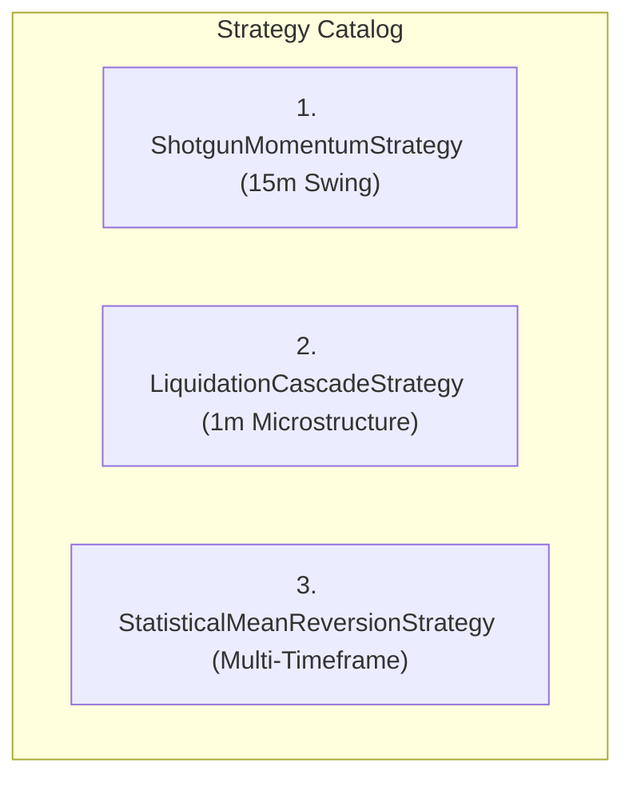

# Strategy Documentation & Mathematical Models

## 1. Strategy Catalog Overview

The unified platform houses three primary, independent strategy modules implementing the `IStrategy` interface:

---

## 2. Strategy 1: `ShotgunMomentumStrategy` (Bot 1 Core)

* **Market Hypothesis**: Sustained multi-candle momentum expansions occur when fast moving averages align with higher-timeframe trend baselines under expanding volatility.
* **Primary Timeframe**: 15-minute.
* **Required Indicators**: EMA 9, EMA 21, EMA 50, EMA 200, ADX 14, Bollinger Band Squeeze (100-period).
* **Entry Rules**:
  * **LONG**: $\text{EMA}_9 > \text{EMA}_{21} > \text{EMA}_{50} > \text{EMA}_{200} \text{ and } \text{ADX}_{14} \ge 25.0 \text{ and } \text{ML Probability} \ge \text{Threshold}_{\text{LONG}}$.
  * **SHORT**: $\text{EMA}_9 < \text{EMA}_{21} < \text{EMA}_{50} < \text{EMA}_{200} \text{ and } \text{ADX}_{14} \ge 25.0 \text{ and } \text{ML Probability} \ge \text{Threshold}_{\text{SHORT}}$.
* **Exit Rules**: Stop-Loss at $1.5 \times \text{ATR}_{14}$; Take-Profit at $2.25 \times \text{ATR}_{14}$ (1:1.5 RRR).
* **Historical Validation (Aug 08 – Aug 25, 2026)**: **71.11% Win Rate**, Profit Factor **3.42** on 45 live testnet trades.

---

## 3. Strategy 2: `LiquidationCascadeStrategy` (Pure Microstructure)

* **Market Hypothesis**: When high-leverage market participants face forced liquidations, large market orders create brief, temporary liquidity exhaustion wicks that revert sharply.
* **Primary Timeframe**: 1-minute tick/microstructure stream (`async_ingestion.py`).
* **Required Data**: Tick liquidation stream, Cumulative Volume Delta (CVD), Level 2 Order Book Depth Imbalance.
* **Entry Rules**:
  * **LONG (Reversal Buy)**: Cumulative short liquidations in 60s exceed $\$100,000\text{ USD}$ AND CVD delta turns positive AND price approaches Level 2 Bid Depth absorption wall.
  * **SHORT (Reversal Sell)**: Cumulative long liquidations in 60s exceed $\$100,000\text{ USD}$ AND CVD delta turns negative AND price approaches Level 2 Ask Depth wall.
* **Exit Rules**: Stop-Loss at $0.8 \times \text{ATR}_{14}$; Take-Profit at mean VWAP target.

---

## 4. Strategy 3: `StatisticalMeanReversionStrategy`

* **Market Hypothesis**: Asset prices in range-bound and consolidating markets exhibit statistical mean reversion when price diverges by $\ge 3.0$ standard deviations from the rolling 200-period mean.
* **Required Indicators**: Rolling 200-period mean $\mu_{200}$, standard deviation $\sigma_{200}$, Choppiness Index $\text{CI}_{14}$.
* **Entry Rules**:
  * **LONG**: $Z = \frac{\text{Close} - \mu_{200}}{\sigma_{200}} \le -3.0 \text{ and } \text{CI}_{14} \ge 55.0$ (Choppy/Range Regime).
  * **SHORT**: $Z = \frac{\text{Close} - \mu_{200}}{\sigma_{200}} \ge +3.0 \text{ and } \text{CI}_{14} \ge 55.0$.
* **Exit Rules**: Exit at $Z = 0.0$ (reversion to mean) or Stop-Loss at $Z = \pm 4.5$.
