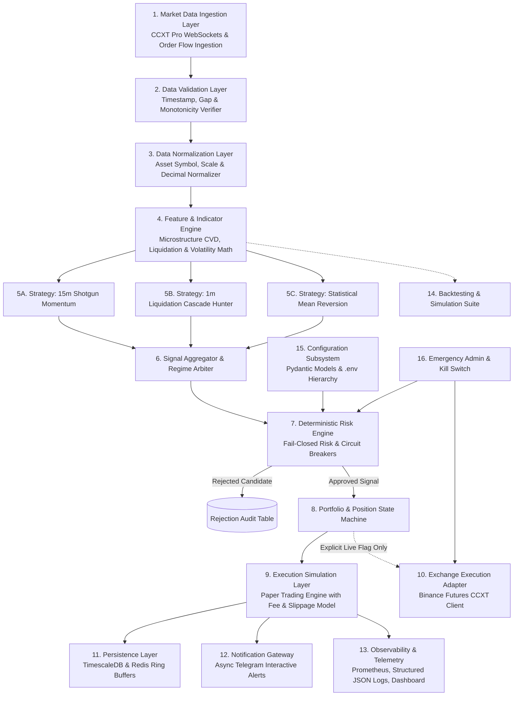

# Target Architecture Blueprint: Unified Quantitative Platform

## 1. 16-Layer Modular Platform Architecture

The target architecture is a decoupled, event-driven quantitative trading and signal platform structured across 16 formal architectural layers:

---

## 2. Layer Responsibilities & Boundaries

| Layer # | Layer Name | Responsibility & Boundary |
| :--- | :--- | :--- |
| **Layer 1** | **Market Data Ingestion** | Connects to Binance Futures WebSockets and REST feeds; streams raw tick trades, klines, liquidations, and depth. |
| **Layer 2** | **Data Validation** | Detects missing candles, out-of-sequence timestamps, price spikes, and stale data streams. |
| **Layer 3** | **Data Normalization** | Standardizes incoming data into immutable dataclass event structures (`CandleEvent`, `TickEvent`, `LiquidationEvent`). |
| **Layer 4** | **Feature & Indicator Engine** | Computes technical indicators and raw order flow metrics (CVD, OI velocity, ATR, ADX, Bollinger Squeeze). |
| **Layer 5** | **Strategy Modules** | Isolated strategy classes implementing the `Strategy` interface. Generates candidate `Signal` objects. |
| **Layer 6** | **Signal Aggregator** | Combines signals from multiple strategies, arbitrates conflicting directions, and weights by market regime. |
| **Layer 7** | **Deterministic Risk Engine** | Enforces fail-closed risk checks: maximum risk per trade, spread ceilings, position limits, and circuit breakers. |
| **Layer 8** | **Portfolio & Position State** | Maintains global portfolio state, cash balance, margin requirements, open positions, and unrealized PnL. |
| **Layer 9** | **Execution Simulation Layer** | Simulates realistic bracket order fills, slippage, taker fees, and latency in `PAPER_TRADING` mode. |
| **Layer 10** | **Exchange Execution Adapter** | Connects to live exchange endpoints. **Disabled by default**; requires manual live override. |
| **Layer 11** | **Persistence Layer** | Persists candlestick data, funding rates, trade executions, and rejection audits in TimescaleDB and Redis. |
| **Layer 12** | **Notification Gateway** | Dispatches interactive signal cards, execution receipts, and daily executive summaries to Telegram. |
| **Layer 13** | **Observability & Telemetry** | Exposes Prometheus metrics (`/metrics`), structured JSON application logs, and Web Dashboard APIs. |
| **Layer 14** | **Backtesting Suite** | Bias-free event-driven backtesting engine with walk-forward validation and parameter sensitivity testing. |
| **Layer 15** | **Configuration Subsystem** | Strongly-typed configuration schema validated via Pydantic with `.env` secrets injection. |
| **Layer 16** | **Kill Switch & Admin** | Emergency operator controls: immediate position closure, trading halt, and service isolation. |
