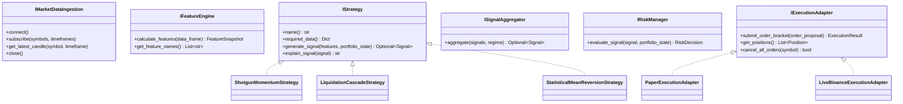

# Target Component Design & Interfaces

## 1. Domain Interfaces & Dependency Injection

The unified platform defines standard abstract base classes (ABCs) in Python to ensure high testability, modularity, and pluggability:



---

## 2. Formal Python Interface Specifications

### Strategy Interface (`IStrategy`)
```python
from abc import ABC, abstractmethod
from typing import Dict, List, Optional
import pandas as pd

class IStrategy(ABC):
    @abstractmethod
    def name(self) -> str:
        """Unique strategy identifier string."""
        pass

    @abstractmethod
    def required_data(self) -> Dict[str, str]:
        """Specifies required timeframes and data streams."""
        pass

    @abstractmethod
    def generate_signal(self, features: Dict[str, float], portfolio_state: Dict) -> Optional[dict]:
        """Evaluates features and returns candidate Signal or None."""
        pass

    @abstractmethod
    def explain_signal(self, signal: dict) -> str:
        """Returns plain-text rationale for why the signal was triggered."""
        pass

    @abstractmethod
    def get_default_configuration(self) -> Dict:
        """Returns default parameter configuration dict."""
        pass
```

### Risk Manager Interface (`IRiskManager`)
```python
class IRiskManager(ABC):
    @abstractmethod
    def evaluate_signal(self, signal: dict, portfolio_state: dict) -> dict:
        """
        Validates signal against risk gates and returns standard RiskDecision:
        {
            "allowed": bool,
            "approved_quantity": float,
            "reasons": List[str],
            "rejection_codes": List[str],
            "limits_applied": dict,
            "risk_snapshot": dict
        }
        """
        pass
```
