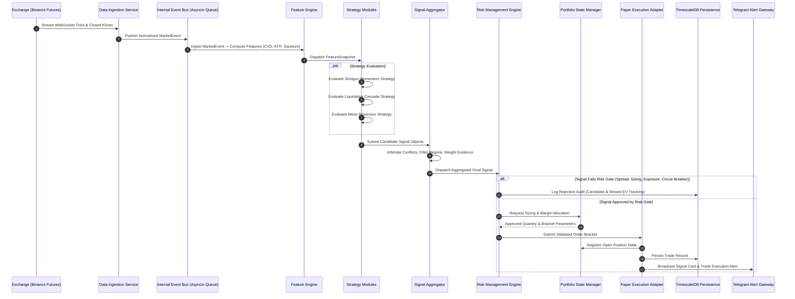

# Target Data Flow & Event Pipelines

## 1. Unified Event-Driven Data Flow

The target architecture operates on an **event-driven pipeline** where data flows sequentially through validation, calculation, strategy evaluation, risk verification, and simulated execution:



---

## 2. Event Schemas & Domain Contracts

### A. `CandleEvent`
```json
{
  "event_type": "CANDLE_CLOSED",
  "exchange": "binance_futures",
  "symbol": "SOL/USDT",
  "timeframe": "1m",
  "timestamp": 1787736900000,
  "open": 96.35,
  "high": 96.42,
  "low": 96.31,
  "close": 96.38,
  "volume": 12450.2,
  "is_closed": true
}
```

### B. `MicrostructureEvent`
```json
{
  "event_type": "ORDER_FLOW_TICK",
  "exchange": "binance_futures",
  "symbol": "SOL/USDT",
  "timestamp": 1787736900500,
  "cvd_1m": 425000.0,
  "oi_change_1m": 12500.0,
  "liquidation_volume_usd": 85000.0,
  "liquidation_side": "SHORT",
  "bid_ask_spread_pct": 0.02
}
```
