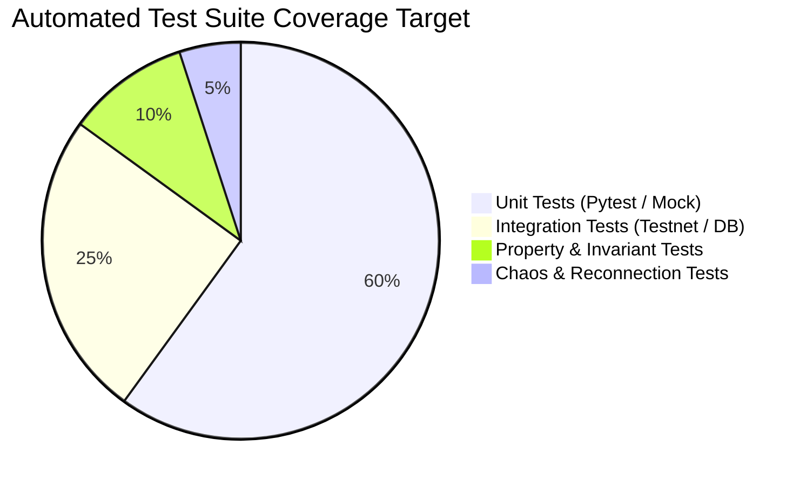

# Testing Strategy & Automated Quality Assurance

## 1. Test Pyramid & Quality Standards

The testing strategy enforces rigorous automated verification across four tiers:

---

## 2. Testing Specifications by Tier

### Tier 1: Unit Tests (`tests/`)
* Tests indicator mathematical correctness against reference TA-Lib datasets.
* Tests `RiskManagementEngine` sizing formulas and boundary conditions (zero balance, huge balance, negative price).
* Tests `SignalContract` JSON schema validation rules.

### Tier 2: Integration Tests
* Tests async WebSocket reconnection handling when network connections drop.
* Tests Redis ring buffer pushing and automatic trimming.
* Tests PostgreSQL asynchronous connection pooling under concurrent write loads.

### Tier 3: Property & Invariant Tests
* **Invariant 1**: Sized risk dollar amount must never exceed `Balance * MaxRiskPct`.
* **Invariant 2**: Stop Loss for LONG must always satisfy $\text{Stop Loss} < \text{Entry} < \text{Take Profit}$.
* **Invariant 3**: Take-Profit to Stop-Loss ratio must always satisfy $\text{RRR} \ge 1.5$.
