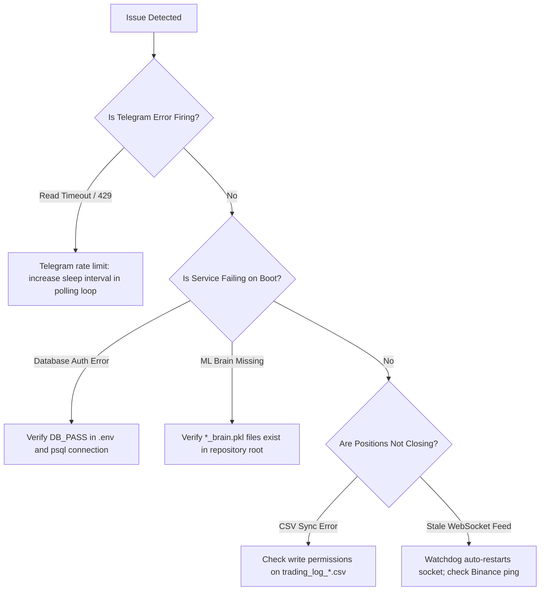

# Troubleshooting Guide & Remediation Procedures

## 1. Diagnostic Decision Tree

---

## 2. Common Runtime Anomalies & Solutions

### Anomaly 1: `HTTPSConnectionPool Read timed out` on Telegram
* **Cause**: Telegram API long-polling timeout when network latency spikes.
* **Impact**: Non-fatal warning; polling loop automatically retries.
* **Fix**: Ensure timeout in `notifier.bot.get_updates(timeout=10)` is configured with a `try/except asyncio.TimeoutError` block.

### Anomaly 2: `Invalid API-key, IP, or permissions for action` (Code -2015)
* **Cause**: Binance API key does not have Futures trading enabled, or the host IP is not whitelisted on Binance.
* **Fix**: Whitelist `187.127.125.221` in the Binance API management portal or switch to `USE_TESTNET=True`.

### Anomaly 3: `Database Permissions / Connection Refused`
* **Cause**: PostgreSQL service stopped or `pg_hba.conf` rejecting md5/scram-sha-256 password.
* **Fix**: Run `sudo systemctl restart postgresql` and verify credentials via `psql -U postgres -d ai_quant_db`.
