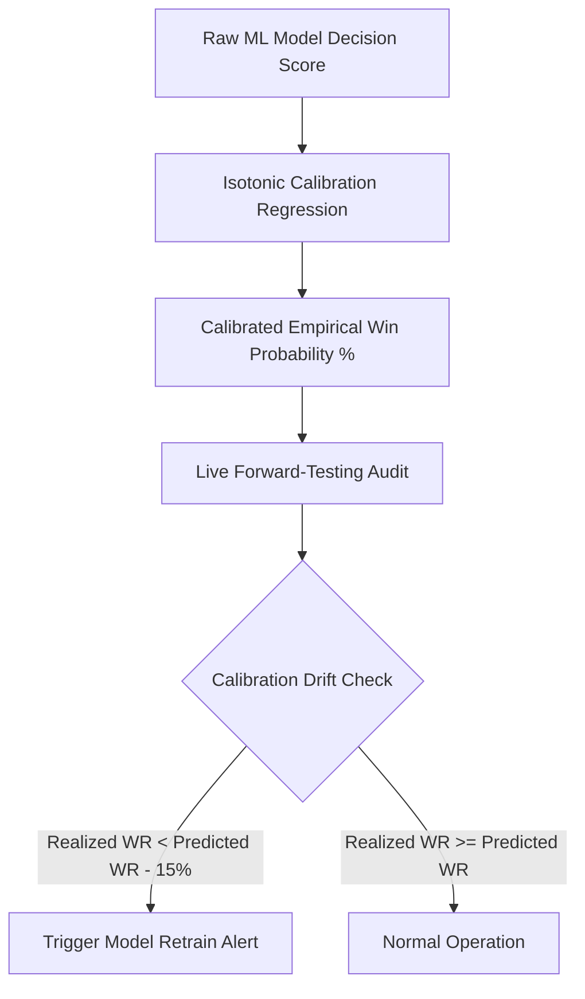

# Model Validation & Calibration Drift Methodology

## 1. Probability Calibration & Walk-Forward Testing

To ensure model confidence scores accurately reflect empirical winning odds, the platform utilizes **Isotonic Probability Calibration** (`models/calibrator.py`):

---

## 2. 5-Point Pre-Flight Production Sanity Suite (`validation_suite.py`)

Before any trading service initializes, it must execute and pass the automated 5-point sanity suite:
1. **[1/5] Binance API Connectivity**: Verifies public ping latency $< 500\text{ ms}$.
2. **[2/5] ML Brain Model Verification**: Validates that pre-trained `.pkl` brain files exist for all target assets and can execute sample dummy predictions without throwing exceptions.
3. **[3/5] Quantitative Feature Integrity**: Validates ADX, ATR, and Choppiness Index mathematical logic against static numerical assertions.
4. **[4/5] Telegram Gateway Liveness**: Dispatches an API `getMe` probe to confirm bot token validity.
5. **[5/5] Database Read/Write Permissions**: Executes test `SELECT` and `INSERT` queries on PostgreSQL tables.
